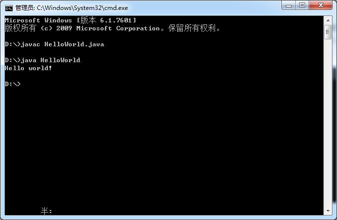

# java-basic

> 项目介绍

java-basic是由本人个人整理的Java 
基础教学文档开源工程，用于巩固个人Java基础只是，加深对Java的理解，同时使用于其他新手作为上手文档用于查看，由于文档内容来源于网络整理以及我个人的理解，有任何不对或者侵权的的地方欢迎来我的[github](https://github.com/JordanHank/java-basic)进行指正。

> Java介绍

 
[Java](https://baike.baidu.com/item/Java/85979?fr=aladdin)
是一门面向对象编程语言，不仅吸收了C++语言的各种优点，还摒弃了C++里难以理解的多继承、指针等概念，因此Java
语言具有功能强大和简单易用两个特征。Java语言作为静态面向对象编程语言的代表，极好地实现了面向对象理论，允许程序员以优雅的思维方式进行复杂的编程。

> Hello World

创建一个HelloWorld.text的文本文件，用编辑器打开编写这个文件的代码，写入下面的代码另存为HelloWorld.java文件。

``` java
public class HelloWorld {

    public static void main(String [] args) {
        System.out.println("Hello world!");
    }

}

```

Ctrl + C 输入cmd进入命令行窗口，输入 cd 文件地址（文件地址可以文件右键查看属性，复制位置），如果文件不是在c盘,则需要先输入对应盘符加：  如E盘输入 E： 回车 然后在输入上一条命令，输入javac 
HelloWorld.java回车会生成HelloWorld.class文件，在输入java HelloWorld 可以看到对应的输入 “Hello world!”。



!> 在初学java的时候建议不要借助ide进行代码的编写，可以使用系统自带的文本编辑器或者第三方编辑器进行代码的编写,推荐使用editplus/notepad++等编辑器，因为自带编辑器可能因为编码问题导致运行出错。
如果出现“编码GBK的不可映射字符”错误，可以通过指定编码格式编译解决，如：javac -encoding UTF-8 XXX.java


