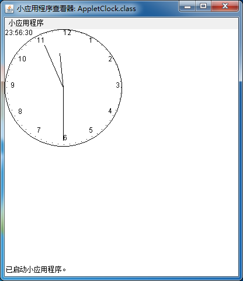

# Applet 时钟示例

Html 代码：

``` html
<!DOCTYPE html>
<html lang="en">
<head>
    <meta charset="UTF-8">
    <title>AppletClock示例</title>
</head>
<body>
<!--调用AppletClock小程序-->
<applet code="AppletClock.class" width="400" height="400">
</applet>
</body>
</html>
```

Java 代码：

``` java
public class AppletClock extends Applet implements Runnable {

    // （x,y）为(0,0)点，表示原点 r表示标准长度
    int x = 0, y = 0, r = 100;

    // 时,分,秒
    int h, m, s;

    //  1°
    double rad = Math.PI / 180;

    //初始化
    public void init() {
        //创建格林威治日历时间
        Calendar now = new GregorianCalendar();

        // 秒针转换成角度：1秒，秒针动一次，转动6° 当前秒针转动度数
        s = now.get(Calendar.SECOND) * 6;

        // 分针转换为角度：1分，分针动一次，转动6° 当前分针转动度数
        m = now.get(Calendar.MINUTE) * 6;

        // 先把分钟数化为小时，再乘以6° 每小时转动30° 当前时针转动度数
        h = now.get(Calendar.HOUR) * 30 + now.get(Calendar.MINUTE) / 12 * 6;

        //启动线程
        Thread t = new Thread(this);
        t.start();
    }

    //画图
    public void paint(Graphics g) {
        /*
         * paint(g)函数会重绘图像，要加上super.paint(g)，表示在原来图像的基础上，再画图。
         * 如果不加super.paint(g)，重绘时，会将原有的绘制清空，再根据paing(g)函数绘制。
         */
        super.paint(g);

        //设置画笔颜色
        g.setColor(Color.BLACK);

        //drawOval(x,y,width,height)以矩形恰好框住椭圆，矩形左上角的顶点坐标为(x,y)
        g.drawOval(x, y, r * 2, r * 2);

        // 秒针 drawLine(a,b,c,d) (a,b)为起始坐标 (c,d)为终点坐标
        int x1 = (int) (90 * Math.sin(rad * s));
        int y1 = (int) (90 * Math.cos(rad * s));
        g.drawLine(r, r, r + x1, r - y1);

        // 分针
        x1 = (int) (80 * Math.sin(rad * m));
        y1 = (int) (80 * Math.cos(rad * m));
        g.drawLine(r, r, r + x1, r - y1);

        // 时针
        x1 = (int) (60 * Math.sin(rad * h));
        y1 = (int) (60 * Math.cos(rad * h));
        g.drawLine(r, r, r + x1, r - y1);

        // 画数字
        int d = 30;
        for (int i = 1; i <= 12; i++) {
            x1 = (int) ((r - 10) * Math.sin(rad * d));
            y1 = (int) ((r - 10) * Math.cos(rad * d));
            g.drawString(i + "", r + x1, r - y1);
            d += 30;
        }

        // 画刻度
        d = 0;
        for (int i = 1; i <= 60; i++) {
            x1 = (int) ((r - 2) * Math.sin(rad * d));
            y1 = (int) ((r - 2) * Math.cos(rad * d));
            g.drawString(".", r + x1, r - y1);
            d += 6;
        }

        // 显示时间
        Calendar now = new GregorianCalendar();
        int a, b, c;
        a = now.get(Calendar.HOUR_OF_DAY);
        b = now.get(Calendar.MINUTE);
        c = now.get(Calendar.SECOND);
        g.drawString(a + ":" + b + ":" + c, 0, 10);

    }

    @Override
    public void run() {
        while (true) {

            try {
                // 间隔一秒
                Thread.sleep(1000);
            } catch (Exception ex) {
            }

            // 秒针每次走6°
            s += 6;

            // 秒针归零
            if (s >= 360) {
                s = 0;
                m += 6;

                // 分针走72°，时针走6° 分针的12倍，时针走一次
                if (m == 72 || m == 144 || m == 288) {
                    h += 6;
                }

                // 分针归零
                if (m >= 360) {
                    m = 0;
                    h += 6;
                }

                // 时针归零
                if (h >= 360) {
                    h = 0;

                }
            }

            // 重新绘制
            this.repaint();
        }
    }
}
```

#### 结果

