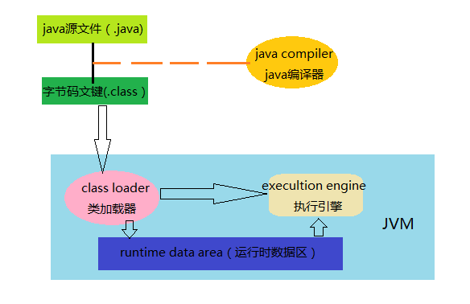

# Java 编译执行过程

Java 最显著的语言特点就是跨平台性，跨平台性指的是通过Java语言编写的应用程序可以在不同的操作系统里运行，前提是装有Java运行环境。Java运行环境主要是安装Java虚拟机（JVM Java Virtual Machine),
Java程序是在虚拟机中运行，而不是操作系统本身，这就是它跨平台的原理。

## 编译过程

简单来说Java编译过程就是将java源文件（.java结尾）通过Java编译器编译为字节码文件（.class结尾），但是实际上Javac编译器进行了许多工作：

1. 词法分析：读取源代码，从源代码中找出了一些规范化的token流,检查文件中的Java 关键字的合法性。

2. 语法分析：对词法分析中得到的token流进行语法分析，检查这些关键词组合在一起是不是符合Java语言规范。

3. 语义分析：语义分析的主要工作就是把一些难懂的，复杂的语法转化成更简单的语法。

4. 字节码生成：将会根据经过注释的抽象语法树生成字节码，也就是将一个数据结构转化为另外一个数据结构。

## 执行过程

执行过程首先由Java 虚拟机JVM中的类加载器加载各个类的字节码文件，加载完成后，再由JVM执行引擎将字节码文件转换为机器码执行，执行字节码转换时会对class
文件进行检查，包括类型检查，数组越界检查，空指针检查等。整个执行过程中，JVM
会占用一段内存空间用于存储执行期间需要用到的数据和相关信息，这段空间一般被称作为Runtime Data Area（运行时数据区），也就是我们常说的JVM内存。

## 查找过程

+ 编译执行.java文件的时候会先从classpath环境变量目录寻找编译后的.class文件
+ 如果classpath以;结尾，在classpath目录找不到执行的类文件，则在当前目录再次寻找一遍对应的.class类文件
+ 如果没有配置;结尾，则不会在当前目录寻找
+ 而没有配置classpath则只在当前目录寻找

更多Java 编译执行过程相关的知识，可以查看我的博客[java内存分配解析](http://www.jordanzhang.xyz/2018/09/26/java%E5%86%85%E5%AD%98%E5%88%86%E9%85%8D%E8%A7%A3%E6%9E%90/)