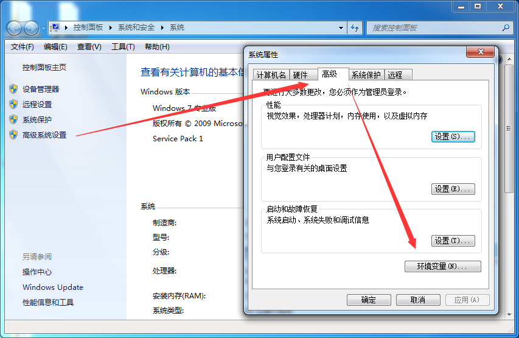

# 环境搭建

## 准备工作

1. 准备可以安装Java开发环境的电脑一台，Windows 系统、Mac OS 系统，Linux 系统都可以
2. 下载Java开发工具包JDK，现在常用版本为JDK 1.7、JDK1.8

## JDK组成

+ javac – 编译器，将源程序转成字节码
+ jar – 打包工具，将相关的类文件打包成一个文件
+ javadoc – 文档生成器，从源码注释中提取文档
+ jdb – debugger，查错工具
+ java – 运行编译后的java程序（.class后缀的）
+ appletviewer：小程序浏览器，一种执行HTML文件上的Java小程序的Java浏览器
+ Javah：产生可以调用Java过程的C过程，或建立能被Java程序调用的C过程的头文件
+ Javap：Java反汇编器，显示编译类文件中的可访问功能和数据，同时显示字节代码含义
+ Jconsole: Java进行系统调试和监控的工具

## 安装JDK

对实现下载好的Java开发工具包JDK进行安装，没有下载的可以[Orcale 官网](http://www.oracle.com/technetwork/java/javase/downloads/index.html)
进行下载。下载解压包之后直接解压点击下一步即可完成安装。

+ 安装JRE，JDK(Java Development Kit) 是 Java 语言的软件开发工具包(SDK),可以选择默认路径进行安装，也可以自行修改安装路径

+ 安装JRE，RE是Java Runtime Environment缩写，指Java运行环境，是Sun的产品，安装同JDK类似，可以选择默认路径进行安装，或者修改路径。

## 配置环境变量

* 右击“我的电脑”，选择“属性”，进入“控制面板主页”

* 点击“高级系统设置”，进入系统属性弹窗页面，点击“高级”页签，选择“环境变量”

* 在系统变量中新建JAVA_HOME 变量，填入JDK安装路径。例如：C:\Program Files (x86)\Java\jdk1.8.0_91

* 编辑系统变量中的Path 变量，在变量值最后输入 %JAVA_HOME%\bin;%JAVA_HOME%\jre\bin;

!> 注意原来Path的变量值末尾有没有;号，如果没有，先输入;号再输入上面的代码

* 在系统变量中新建CLASSPATH 变量，填入 .;%JAVA_HOME%\lib\dt.jar;%JAVA_HOME%\lib\tools.jar;

!> 注意最前面有英文.号

可以通过Ctrl + C 输入cmd 调出命令行界面，然后输入java -version 判断环境是否安装成功。
  
