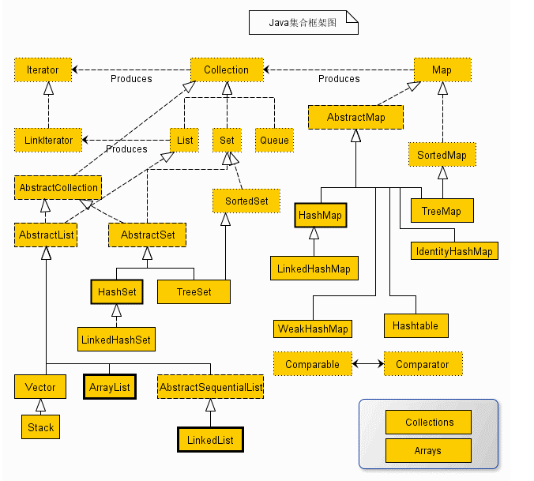
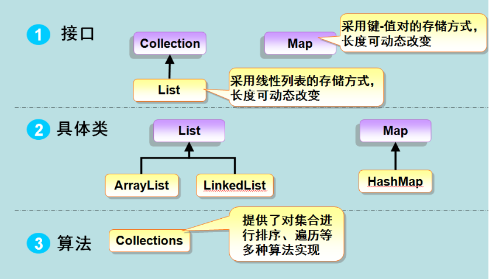

# 集合框架

Java 集合框架主要包括两种类型的容器：

+ 一种是集合（Collection），存储一个元素集合。

+ 另一种是图（Map），存储键/值对映射。



## 设计目标

集合框架被设计成要满足以下几个目标:

+ 该框架必须是高性能的。基本集合（动态数组，链表，树，哈希表）的实现也必须是高效的。

+ 该框架允许不同类型的集合，以类似的方式工作，具有高度的互操作性。

+ 对一个集合的扩展和适应必须是简单的。

整个集合框架就围绕一组标准接口而设计,所以实现这些接口也可以定义自己的集合类。

## 框架内容

所有的集合框架都包含如下内容：统一的接口、具体的实现和可用的算法。



+ 统一的接口：

    + Collection 接口存储一组不唯一的无序对象，不可以直接继承。
    
    + List 接口存储一组不唯一的有出入顺序的对象，允许有相同对象，通过下标index访问。
    
    + Set 接口存储一组唯一无序的对象，不保存重复对象。
    
    + SortedSet 继承自Set保存有序的集合。
    
    + Map 接口存储一组键值对象，提供key（键）到value（值）的映射。
    
    + Map.Entry 描述在一个Map中的一个元素（键/值对），是一个Map的内部类.
    
    + SortedMap 继承于 Map，使 Key 保持在升序排列。
    
    + Enumeration 可以枚举对象集合中的元素，已被迭代器取代。
    
+ 具体的实现：

    + AbstractCollection  实现了大部分的集合接口。
    
    + AbstractList 继承于AbstractCollection 并且实现了大部分List接口。
    
    + AbstractSequentialList 继承于 AbstractList ，提供了对数据元素的链式访问而不是随机访问。
    
    + LinkedList 实现了List接口，允许有null（空）元素，非同步线程不安全，查找效率低。
    
    + ArrayList 实现了List的接口，随机访问性能高，插入删除效率低，非同步线程不安全。
    
    + AbstractSet 继承于AbstractCollection 并且实现了大部分Set接口。
    
    + HashSet 实现了Set接口，不允许出现重复元素，不保证集合中元素的顺序，最多允许一个包含值为null的元素。
    
    + LinkedHashSet 具有可预知迭代顺序的 Set 接口的哈希表和链接列表实现。
    
    + TreeSet 实现了Set接口，可以实现排序等功能。
    
    + AbstractMap 实现了大部分的Map接口。
    
    + HashMap 实现了Map接口，根据键的HashCode值存储数据，具有很快的访问速度，最多允许一条记录的键为null，不支持线程同步。
    
    + TreeMap 继承了AbstractMap，并且使用一颗树。
    
    + WeakHashMap 继承AbstractMap类，使用弱密钥的哈希表。
    
    + LinkedHashMap 继承于HashMap，使用元素的自然顺序对元素进行排序。
    
    + IdentityHashMap 继承AbstractMap类，比较文档时使用引用相等。
    
+ 算法：集合框架定义了几种算法，可用于集合和映射。这些算法被定义为集合类的静态方法。

Java 提供的集合框架位于java.util包中，所以使用时必须引入相应的包。

## 遍历

集合的遍历肯定少不了[for循环](/statement/circulation#for-statement)语句，但是具体使用方式根据集合类型有所不同。

#### List 遍历

List 集合的遍历方法有以下三种：

+ [简单for循环](/statement/circulation#basic-for)遍历：

``` java
List<String> sports = new ArrayList<>();
//添加元素
sports.add("basketball");
sports.add("football");
sports.add("tennis");

for (int i = 0; i < sports.size(); i++) {
    //获取元素
    System.out.print(sports.get(i) + " ");
}
```

+ [增强for循环](/statement/circulation#foreach)遍历：

``` java
List<String> sports = new ArrayList<>();
//添加元素
sports.add("basketball");
sports.add("football");
sports.add("tennis");

for (String sport: sports) {
    System.out.print(sport + " ");
}
```

+ 使用迭代器Iterator 遍历：

``` java
List<String> sports = new ArrayList<>();
//添加元素
sports.add("basketball");
sports.add("football");
sports.add("tennis");

Iterator<String> iterator = sports.iterator();
while (iterator.hasNext()) {
    System.out.print(iterator.next() + " ");
}
```

#### Map 遍历

Map 集合的遍历方法有以下四种：

+ 通过遍历key 遍历：

``` java
Map<String, String> userInfo = new HashMap<>();
//添加键值对
userInfo.put("name", "Jordan Zhang");
userInfo.put("hobby", "listen to music");
userInfo.put("gender", "man");

for (String key: userInfo.keySet()) {
    System.out.println("key:" + key + " and value:" + userInfo.get(key));
}
```

+ 通过遍历value 遍历，不能拿到key：

``` java
Map<String, String> userInfo = new HashMap<>();
//添加键值对
userInfo.put("name", "Jordan Zhang");
userInfo.put("hobby", "listen to music");
userInfo.put("gender", "man");

for (String value: userInfo.values()) {
    System.out.println("value:" + value);
}
```

+ 迭代器迭代Map.Entry 内部类进行遍历：

``` java
Map<String, String> userInfo = new HashMap<>();
//添加键值对
userInfo.put("name", "Jordan Zhang");
userInfo.put("hobby", "listen to music");
userInfo.put("gender", "man");

Iterator<Map.Entry<String, String>> it = userInfo.entrySet().iterator();
while (it.hasNext()) {
    Map.Entry<String, String> entry = it.next();
    System.out.println("key:" + entry.getKey() + " and value:" + entry.getValue());
}
```

+ 通过Map.Entry 内部类进行遍历，容量大时推荐使用：

``` java
Map<String, String> userInfo = new HashMap<>();
//添加键值对
userInfo.put("name", "Jordan Zhang");
userInfo.put("hobby", "listen to music");
userInfo.put("gender", "man");

for (Map.Entry<String, String> entry: userInfo.entrySet()) {
    System.out.println("key:" + entry.getKey() + " and value:" + entry.getValue());
}
```