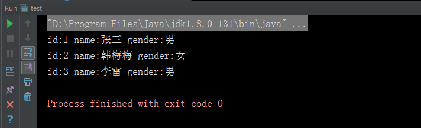

# JDBC 连接

进行Java 程序开发，经常会涉及到数据库的操作，特别是进行web应用开发时更是少不了数据库的操作。常用的数据库有MySQL、Oracle、SQL Server等几种，
Java 程序进行数据库操作的时候需要使用的就是JDBC 连接。

## 驱动包

不同的数据库操作，需要下载不同的数据库驱动包，下面给出常用数据库的下载地址：

+ My SQL数据库：http://dev.mysql.com/downloads/connector/j/ ，解压后得到jar库文件，然后在对应的项目中导入该库文件。

+ Oracle 数据库：https://www.oracle.com/technetwork/cn/database/features/jdbc/index-093096-zhs.html ，对应各个版本的Oracle 数据库驱动。

+ SQL Server 数据库：https://www.microsoft.com/zh-cn/sql-server/sql-server-downloads ，下载最新的驱动包。

## 查询步骤

通过JDBC 连接数据库主要分为下面几步：

1. 加载对应数据库驱动。

2. 通过用户名和密码，连接对应的数据库。

3. 实例化Statement对象。

4. 执行SQL语句。

5. 处理结果集。

#### 示例

下面以连接本地My SQL数据库查询用户信息为例：

User 数据库表结构：

``` sql
CREATE TABLE `User` (
  `id` int(11) NOT NULL AUTO_INCREMENT,
  `name` char(20) NOT NULL DEFAULT '' COMMENT '用户姓名',
  `gender` int(1) NOT NULL DEFAULT 0 COMMENT '0-男，1-女',
  PRIMARY KEY (`id`)
) ENGINE=InnoDB AUTO_INCREMENT=10 DEFAULT CHARSET=utf8;
```

数据：

|id | name | gender |
|---| ---| ---|
|1 | 张三 | 0 |
|2 | 韩梅梅 | 1 |
|3 | 李雷 | 0 |

Java 代码：

``` java
public class JDBCIntro {

    // JDBC 驱动名及数据库 URL
    static final String JDBC_DRIVER = "com.mysql.jdbc.Driver";
    static final String DB_URL = "jdbc:mysql://localhost:3306/User";

    // 数据库的用户名与密码，需要根据自己的设置
    static final String USER = "root";
    static final String PASS = "123456";

    public static void main(String[] args) {

        Connection conn = null;
        Statement stmt = null;
        try {
            // 注册 JDBC 驱动
            Class.forName(JDBC_DRIVER);

            // 打开链接
            System.out.println("连接数据库...");
            conn = DriverManager.getConnection(DB_URL, USER, PASS);

            // 执行查询
            System.out.println(" 实例化Statement对象...");
            stmt = conn.createStatement();
            String sql;
            sql = "SELECT id, name, gender FROM user";
            //执行查询sql 返回结果集
            ResultSet rs = stmt.executeQuery(sql);

            // 展开结果集数据库
            while (rs.next()) {
                // 通过字段检索
                String id = rs.getString("id");
                String name = rs.getString("name");
                String genderInt = rs.getString("gender");
                String gender = "男";
                if (Integer.valueOf(genderInt) == 1 ) {
                    gender = "女";
                }

                // 输出数据
                System.out.println("id:" + id + " name:" + name + " gender:" + gender);
            }
            // 完成后关闭
            rs.close();
            stmt.close();
            conn.close();
        } catch (SQLException se) {
            // 处理 JDBC 错误
            se.printStackTrace();
        } catch (Exception e) {
            // 处理 Class.forName 错误
            e.printStackTrace();
        } finally {
            // 关闭资源
            try {
                if(stmt != null) {
                    stmt.close();
                }
            } catch (SQLException se2) {
                se2.printStackTrace();
            }
            try {
                if(conn != null) {
                    conn.close();
                }
            } catch (SQLException se) {
                se.printStackTrace();
            }
        }
    }
}
```

#### 结果

