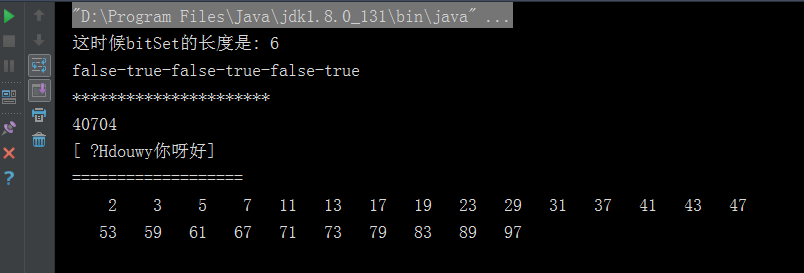

# BitSet 类

此类实现了一个按需增长的位向量。位 set 的每个组件都有一个 boolean 值。用非负的整数将 BitSet 的位编入索引。可以对每个编入索引的位进行测试、设置或者清除。通过逻辑与、逻辑或和逻辑异或操作，可以使用一个 BitSet
 修改另一个 BitSet 的内容。

## 构造函数

BitSet有两个初始化的构造函数，一个带参数，一个不带参数。

不带参数的构造函数：
``` java
BitSet()
```

带参数的构造函数：
``` java
BitSet(int size)
```

带参数的构造函数是指定数组内存大小，由于BitSet底层是long[]数组，所以BitSet最小的size是64，默认就是64位，指定大小后值也是64的整数倍。

## 常用方法

|方法名  |  作用描述|
|---| ---|
|void flip(int bitIndex) | 将指定索引处的位设置为其当前值的补码 |
|void flip(int fromIndex,int toIndex) | 将指定的 fromIndex（包括）到指定的 toIndex（不包括）范围内的每个位设置为其当前值的补码|
|void set(int bitIndex) | 将指定索引处的位设置为 true|
|void set(int bitIndex,boolean value) | 将指定索引处的位设置为指定的值 |
|void set(int fromIndex,int toIndex) | 将指定的 fromIndex（包括）到指定的 toIndex（不包括）范围内的位设置为 true|
|void set(int fromIndex,int toIndex,boolean value) | 将指定的 fromIndex（包括）到指定的 toIndex（不包括）范围内的位设置为指定的值|
|void clear(int bitIndex) | 将索引指定处的位设置为 false|
|void clear(int fromIndex,int toIndex) | 将指定的 fromIndex（包括）到指定的 toIndex（不包括）范围内的位设置为 false|
|void clear() | 将此 BitSet 中的所有位设置为 false|
|boolean get(int bitIndex) | 返回指定索引处的位值。如果当前已设置了此 BitSet 中索引 bitIndex 处的位，则返回 true；否则结果为 false|
|BitSet get(int fromIndex,int toIndex) | 返回一个新的 BitSet，它由此 BitSet 中从 fromIndex（包括）到 toIndex（不包括）范围内的位组成|
|int nextSetBit(int fromIndex) | 返回第一个设置为 true 的位的索引，这发生在指定的起始索引或之后的索引上。如果没有这样的位，则返回 -1|
|int nextClearBit(int fromIndex) | 返回第一个设置为 false 的位的索引，这发生在指定的起始索引或之后的索引上 |
|int length() | 返回此 BitSet 的“逻辑大小”： BitSet 中最高设置位的索引加 1。如果 BitSet 中不包含任何设置位，则返回零|
|boolean isEmpty() | 如果此 BitSet 中没有包含任何设置为 true 的位，则返回 ture|
|boolean intersects(BitSet set) |如果指定的 BitSet 中有设置为 true 的位，并且在此 BitSet 中也将其设置为 true，则返回 ture|
|int cardinality() | 返回此 BitSet 中设置为 true 的位数|
|void and(BitSet set) | 对此目标位 set 和参数位 set 执行逻辑 与操作。当且仅当目标位 set 的初始值均为 true，并且位 set 参数中对应位的值也为 true 时才修改此位 set，这样其内每个位的值均为 true|
|void or(BitSet set) | 对此位 set 和位 set 参数执行逻辑 或操作。当且仅当此位 set 中某个位的值为 true，或者位 set 参数中对应位的值为 true 时才修改此位 set，这样其内该位的值为 true|
|void xor(BitSet set) |对此位 set 和位 set 参数执行逻辑 异或操作。当且仅当以下语句之一成立时才修改此位 set，这样其内某个位的值为 true|
|void andNot(BitSet set) | 清除此 BitSet 中所有的位，其相应的位在指定的 BitSet 中已设置|
|int hashCode() |返回此位 set 的哈希码值。哈希码只取决于此 BitSet 中已经设置的位 |
|int size() | 返回此 BitSet 表示位值时实际使用空间的位数。set 中值最大的元素是第 size - 1 个元素 |
|boolean equals(Object obj) | 将此对象与指定的对象进行比较。当且仅当参数不是 null，并且是一个与此位 set 有着完全相同的位 set 设置（为 true）的 Bitset 对象时，结果才为 true |
|Object clone() | 复制此 BitSet，生成一个与之相等的新 BitSet。复制得到的是另一个位 set，它与此位 set 有着完全相同的、设置为 true）的位|
|String toString() |返回此位 set 的字符串表示形式。对于此 BitSet 中包含的、处于已设置状态的每个位的索引，在结果中会包含这些索引的十进制表示形式。这些索引是按从低到高的顺序列出的、之间用"," 分隔（一个逗号加一个空格），并用括号括起来，结果形成了一组整数的常用数学符号|

## 应用场景

BitSet 类常见的应用场景是对海量数据进行一些统计工作，比如日志分析、用户数统计等。

## 示例
``` java
public class Demo {

    public static void main(String [] args) {

        //把 1 3 5 三个数放bitSet中
        BitSet bitSet=new BitSet();
        bitSet.set(1);
        bitSet.set(3);
        bitSet.set(5);

        //bitSet.length()返回此 BitSet 的"逻辑大小"：BitSet 中最高设置位的索引加 1。
        System.out.println("这时候bitSet的长度是: " + bitSet.length());
        for(int i=0; i<bitSet.length(); i++) {
            if ( i != bitSet.length() -1) {
                System.out.print(bitSet.get(i)+"-");
            } else {
                System.out.print(bitSet.get(i) + "\n");
            }

        }
        System.out.println("**********************");

        //BitSet使用示例
        BitSetIntro.containChars("How do you do? 你好呀");

        System.out.println("===================");
        BitSetIntro.computePrime(100);

    }

    /**
     * 求一个字符串包含的char
     */
    public static void containChars(String str) {
        BitSet used = new BitSet();
        for (int i = 0; i < str.length(); i++) {
            //used.set()将指定索引处的位设置为 true。
            used.set(str.charAt(i));
        }

        StringBuilder sb = new StringBuilder();
        sb.append("[");
        int size = used.size();
        System.out.println(size);
        for (int i = 0; i < size; i++) {
            //used.get() 返回指定索引处的位值。
            if (used.get(i)) {
                sb.append((char) i);
            }
        }
        sb.append("]");
        System.out.println(sb.toString());
    }


    /**
     * 求素数 有无限个。一个大于1的自然数
     * 如果除了1和它本身外，不能被其他自然数整除(除0以外）的数称之为素数(质数）
     * 否则称为合数
     */
    public static void computePrime(int size) {
        BitSet sieve = new BitSet(size);
        for (int i = 2; i < size; i++) {
            sieve.set(i);
        }
        int finalBit = (int) Math.sqrt(sieve.size());

        for (int i = 2; i < finalBit; i++) {
            if (sieve.get(i)) {
                for (int j = 2 * i; j < size; j += i) {
                    // sieve.clear() 将索引指定处的位设置为 false。
                    sieve.clear(j);
                }
            }
        }

        int counter = 0;
        for (int i = 1; i < size; i++) {
            if (sieve.get(i)) {
                System.out.printf("%5d", i);
                if (++counter % 15 == 0) {
                    System.out.println();
                }
            }
        }
        System.out.println();
    }

}
```

#### 结果

