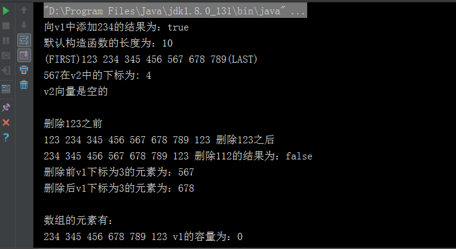

# Vector 向量

Vector 类可以实现可增长的对象数组。与数组一样，它包含可以使用整数索引进行访问的组件，但是两者是不同的：

+ Vector的大小能根据需要动态的变化；数组大小是固定的。

+ Vector是同步访问的，线程安全；数组不是线程安全的。

## 构造函数

Vector类的四种构造函数：

默认无参构造函数创建一个默认的向量，默认大小为10。
``` java
Vector();
```

含参数initialCapacity的构造函数，创建指定大小的向量。
``` java
Vector(int initialCapacity) 
```

含参数initialCapacity和capacityIncrement的构造函数，创建指定大小的向量，并且指定向量每次增加的元素数目。
``` java
Vector(int initialCapacity, int capacityIncrement) 
```

含参数集合Collection的构造函数，创建一个包含指定 collection 中的元素的向量，这些元素按其 collection 的迭代器返回元素的顺序排列。
``` java
Vector(Collection<? extends E> c) 
```

## 常用方法

|方法名  |  作用描述|
|---| ---|
|boolean add(E e) |  将指定元素添加到此向量的末尾|
|void add(int index, E element)  |  在此向量的指定位置插入指定的元素|
|boolean addAll(Collection<? extends E> c)  | 将指定 Collection 中的所有元素添加到此向量的末尾，按照指定 collection 的迭代器所返回的顺序添加这些元素|
|boolean addAll(int index, Collection<? extends E> c)  |  在指定位置将指定 Collection 中的所有元素插入到此向量中|
|void addElement(E obj)  | 将指定的组件添加到此向量的末尾，将其大小增加 1 |
|int capacity() |  返回此向量的当前容量|
|void clear() | 从此向量中移除所有元素|
|Object clone() | 返回向量的一个副本 |
|boolean contains(Object o)  | 如果此向量包含指定的元素，则返回 true|
|boolean containsAll(Collection<?> c)  | 如果此向量包含指定 Collection 中的所有元素，则返回 true|
|void copyInto(Object[] anArray)  | 将此向量的组件复制到指定的数组中|
|E elementAt(int index) | 返回指定索引处的组件|
|Enumeration<E> elements() | 返回此向量的组件的枚举|
|void ensureCapacity(int minCapacity) | 增加此向量的容量（如有必要），以确保其至少能够保存最小容量参数指定的组件数|
|boolean equals(Object o) | 比较指定对象与此向量的相等性|
|E firstElement() | 返回此向量的第一个组件（位于索引 0) 处的项）|
|E get(int index) | 返回向量中指定位置的元素|
|int hashCode() | 返回此向量的哈希码值|
|int indexOf(Object o) |  返回此向量中第一次出现的指定元素的索引，如果此向量不包含该元素，则返回 -1|
|int indexOf(Object o, int index) |返回此向量中第一次出现的指定元素的索引，从 index 处正向搜索，如果未找到该元素，则返回 -1|
|void insertElementAt(E obj, int index) |将指定对象作为此向量中的组件插入到指定的 index 处|
|boolean isEmpty() |测试此向量是否不包含组件|
|E 	lastElement() | 返回此向量的最后一个组件|
|int lastIndexOf(Object o) |返回此向量中最后一次出现的指定元素的索引；如果此向量不包含该元素，则返回 -1|
|int lastIndexOf(Object o, int index) | 返回此向量中最后一次出现的指定元素的索引，从 index 处逆向搜索，如果未找到该元素，则返回 -1|
|E remove(int index) |移除此向量中指定位置的元素|
|boolean remove(Object o) | 移除此向量中指定元素的第一个匹配项，如果向量不包含该元素，则元素保持不变|
|boolean removeAll(Collection<?> c) |从此向量中移除包含在指定 Collection 中的所有元素|
|void removeAllElements() | 从此向量中移除全部组件，并将其大小设置为零|
|boolean removeElement(Object obj) | 从此向量中移除变量的第一个（索引最小的）匹配项|
|void removeElementAt(int index) |删除指定索引处的组件|
|protected  void removeRange(int fromIndex, int toIndex) |从此 List 中移除其索引位于 fromIndex（包括）与 toIndex（不包括）之间的所有元素|
|boolean retainAll(Collection<?> c) | 在此向量中仅保留包含在指定 Collection 中的元素|
|E set(int index, E element) | 用指定的元素替换此向量中指定位置处的元素|
|void setElementAt(E obj, int index)| 将此向量指定 index 处的组件设置为指定的对象|
|void setSize(int newSize) | 设置此向量的大小|
|int size() | 返回此向量中的组件数|
|List<E> subList(int fromIndex, int toIndex) |返回此 List 的部分视图，元素范围为从 fromIndex（包括）到 toIndex（不包括）|
|Object[] 	toArray() | 返回一个数组，包含此向量中以恰当顺序存放的所有元素| 
|<T> T[] toArray(T[] a) | 返回一个数组，包含此向量中以恰当顺序存放的所有元素；返回数组的运行时类型为指定数组的类型|
|String toString() |返回此向量的字符串表示形式，其中包含每个元素的 String 表示形式|
|void 	trimToSize() | 对此向量的容量进行微调，使其等于向量的当前大小|

## 示例

``` java
public class Demo {

    public static void main(String [] args) {
        Vector v1 = new Vector();

        //向向量Vector中添加元素
        v1.addElement("123");
        boolean res = v1.add("234"); //返回添加后的结果，true为添加成功，false为添加失败
        System.out.println("向v1中添加234的结果为：" + res);

        List<String> collection = new ArrayList<>();
        for (int i = 3; i < 8; i++) {
            String str = i + "" + (i + 1) + "" + (i + 2);
            collection.add(str);
        }
        v1.addAll(collection);

        //获取向量的长度
        int length = v1.capacity();
        System.out.println("默认构造函数的长度为：" + length);

        //clone()方法返回向量的一个副本
        Vector v2 = (Vector) v1.clone();

        //获取第一个元素
        String first = v2.firstElement().toString();
        //获取最后一个元素
        String last = v2.lastElement().toString();

        //获取向量中的元素个数
        int size = v2.size();
        for (int i = 0; i < size; i++) {
            //获取指定index的元素
            String str = v2.elementAt(i).toString();

            if (str.equals(first)) {
                System.out.print("(FIRST)" + "");
            }

            //判断向量中是否包含某个元素 包涵返回true 反之返回false
            if (v2.contains("345")) {
                if (i != size -1) {
                    System.out.print(str + " ");
                } else {
                    System.out.print(str);
                }
            }
            if (str.equals(last)) {
                System.out.println("(LAST)");
            }
        }

        //查找元素下标Index  如果存在返回下标  否则返回-1
        int exist = v2.indexOf("567");
        System.out.println("567在v2中的下标为: " + exist);

        //清空向量的所有元素
        v2.clear();
        //判断向量是否为空
        if (v2.isEmpty()) {
            System.out.println("v2向量是空的");
            System.out.println();
        }

        v1.add("123");
        System.out.println("删除123之前");
        for (Object str : v1) {
            System.out.print(str + " ");
        }

        //删除向量中的第一个匹配元素 如果没有则不变
        v1.remove("123");
        System.out.println("删除123之后");
        for (Object str : v1) {
            System.out.print(str + " ");
        }

        //删除向量的第一个匹配元素和remove()的用法类似不过有返回结果
        boolean re = v1.removeElement("112");
        System.out.println("删除112的结果为：" + re);

        System.out.println("删除前v1下标为3的元素为：" + v1.get(3));

        //删除指定下标的元素
        v1.removeElementAt(3);
        System.out.println("删除后v1下标为3的元素为：" + v1.get(3));

        //返回一个数组，包含此向量中以恰当顺序存放的所有元素。
        Object [] arr = v1.toArray();

        System.out.println("数组的元素有：");
        for (Object obj: arr) {
            System.out.print(obj + " ");
        }

        //删除所有元素与clear()方法类似
        v1.removeAllElements();
        System.out.println("v1的容量为：" + v1.size());
    }
}
```

#### 结果


