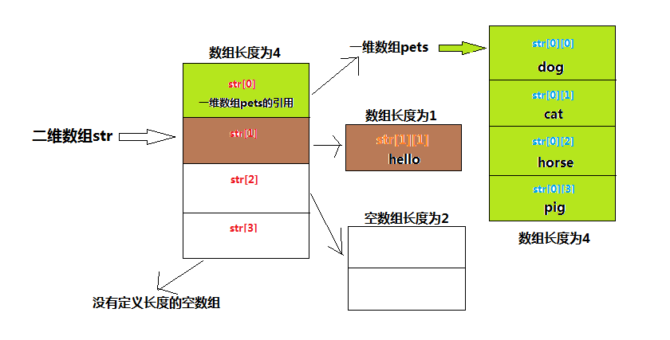
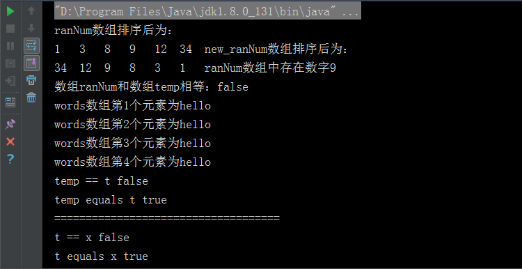

# 数组

数组在Java 中是一个数据结构，用于存储相同类型的元素。数组是一种特殊的类型，在底层内存可以将连续的内存空间称为数组，而内存空间存储的数据就是对应的数组元素。

## 定义

数组的定义有以下两种，推荐第一种，第二种是C、C++的语言风格。
``` java
//数据类型 [] 变量名
int [] arr;

//数据类型 变量名 []
int arr [];
```

## 声名创建

数组是特殊的引用类型，引用类型都通过new来创建。因为数组时连续的内存空间，所以创建时必须确定空间的长度,长度必须是确定的int数据。

``` java
//创建数组
int size = 5;
numbers = new int[size];
//通过下标index使用数组存储数据 下标从0开始
numbers[0] = 3;
numbers[1] = 34;
numbers[2] = 67;
numbers[3] = 12;
numbers[4] = 54;

//数组的声名创建可以一起使用
String [] pets = {"dog", "cat", "horse", "pig"};
```

`String [] pets = {"dog", "cat", "horse", "pig"};`在内存中的存储状态：

+ 变量pets记录了四个String类型变量的内存地址

+ pets[0] 记录了 dog 的内存地址，相应的内存地址存储了String 数据dog

+ pets[1] 记录了 cat 的内存地址，相应的内存地址存储了String 数据cat

+ pets[2] 记录了 horse 的内存地址，相应的内存地址存储了String 数据horse

+ pets[1] 记录了 pig 的内存地址，相应的内存地址存储了String 数据pig

## 操作数组

数组的元素类型和数组的大小都是确定的，所以当处理数组元素时候，我们通常使用[基本for 循环](/statement/circulation#basic-for)通过数组下标操作数组数据或者使用[增强for 循环](/statement/circulation#foreach)直接处理数据。

``` java
//基本for循环操作数组
int sum = 0;
for (int i = 0; i < numbers.length; i++) {
    sum += numbers[i];
}
System.out.println("数组numbers的总和是" + sum);

//增强for循环处理数组
for(String type: pets) {
    System.out.println("这只宠物是" + type);
}
```

## 多维数组

数组是用于存储相同类型的元素的特殊类型，所以多维数组可以看作是数组的数组，这样类比普通数组就容易理解的多了。多维数组的定义以及使用,
只需要确定第一维的长度即可。二维数组可以简单的理解为一维数据对应存储的是另一个数组的地址，所以只要确定第一维长度即可，第二维可以在使用的时候再确定长度。

**定义：** 跟普通数组声名定义类似，几维数组就在数据类型后面有几个`[]`，但一般一维数组用的最多。
``` java
//定义二维数组
String [][] str = new String[4][3];
```

**示例：** 以下面的示例为例讲解下多维数组存储的对应关系。
``` java
//一维数组定义声名使用
String [] pets = {"dog", "cat", "horse", "pig"};
//二维数组定义声名使用
String [][] str = new String[4][];
str [0] = pets;
str [1] = new String [1];
str [1][0] = "hello";
str [2] = new String [2];
``` 

+ 先声名创建了一个空间长度为4的一维数组，分别存储了dog，cat，horse, pig的数据，赋值给变量pets。

+ 声名一个二维数组,第一维空间长度为4，第二位空间长度不定，赋值给变量str。

+ 将数组pets赋值为str第一维数组的第一个元素。

+ 向str第一维数组的第二个元素存储为长度空间为1的空数组。

+ 向str第一维数组空间中存储的一维数组中存储数据hello。

+ 向str第一维数组的第三个元素存储为空间长度为2的空数组。

+ str第一维数组的最后空间没有存储数据。



## Arrays 类
Arrays 类位于java.util包中，是Java 提供的专门用于操作数组的工具类。

**常用方法：** Arrays 类提供的都是[static修饰符](/grammer/modifier#type)修饰的静态方法，可以直接` Arrays.方法名` 的形式使用。

|方法名  |  作用描述|
|---| ---|
|Arrays.sort(int [] a)  |  对int类型数组进行排序，默认升序  | 
|Arrays.sort(T[] a, Comparator<? super T> c)  |  对泛型数组进行排序，需要自己提供比较器  | 
|Arrays.binarySearch(int[] a, int key) |  对int类型数组进行二分查找key，如果找到返回下标index,否则返回-1 |
|Arrays.equals(int[] a, int[] a2)  |  比较两个int数组是否相等，相等返回true，否则返回false |
|Arrays.fill(Object[] a, Object val);  |  向对象数组中添加元素  |
|Arrays.copyOf(int[] original, int newLength)  |  拷贝一个int数组的指定长度，返回包含指定长度元素的新int数组  |

**示例：**
``` java
public class ArrDemo {

    public static void main(String [] args) {
        //java.util.Arrays类是专门用来操作数组的
        int [] ranNum = {1, 9, 12, 3, 8, 34};

        //排序 默认升序
        Arrays.sort(ranNum);
        System.out.println("ranNum数组排序后为：");
        for(int rag: ranNum) {
            System.out.print(rag + "\t");
        }
        Integer [] new_ranNum = new Integer[ranNum.length];
        for (int i = 0; i < ranNum.length; i++) {
            new_ranNum[i] = ranNum[i];
        }
        Arrays.sort(new_ranNum, new MyComparator());
        System.out.println("new_ranNum数组排序后为：");
        for(int rag: new_ranNum) {
            System.out.print(rag + "\t");
        }

        //二分查找  如果存在返回下标 不存在返回-1
        int exist = Arrays.binarySearch(ranNum, 7);
        if (exist > -1) {
            System.out.println("ranNum数组中存在数字7");
        }
        exist = Arrays.binarySearch(ranNum, 9);
        if (exist > -1) {
            System.out.println("ranNum数组中存在数字9");
        }

        //判断两个数组是否相等 返回boolean值 相等为true 不等为false
        int [] temp = {1, 3, 5, 7};
        System.out.println("数组ranNum和数组temp相等：" + Arrays.equals(ranNum, temp));

        //填充数组
        String [] words = new String[4];
        for(int i = 0; i < words.length; i++) {
            if (null != words[i]) {
                System.out.println("有数据");
            }
        }
        String el = "hello";
        Arrays.fill(words, el);
        for(int i = 0; i < words.length; i++) {
            String word = words[i];
            System.out.printf("words数组第%d个元素为%s", i + 1, word);
            System.out.println();
        }

        //数组的拷贝
        int [] t = Arrays.copyOf(temp, temp.length);
        //Arrays.copyOf()的底层实现还是借助的本地方法System.arraycopy()
        int [] x = new int[temp.length];
        System.arraycopy(temp, 0, x, 0, temp.length);
        System.out.println("temp == t " + (temp == t));
        System.out.println("temp equals t " + (Arrays.equals(temp, t)));
        System.out.println("====================================");
        System.out.println("t == x " + (t == x));
        System.out.println("t equals x " + (Arrays.equals(t, x)));
    }
}

class MyComparator implements Comparator<Integer> {

    public int compare(Integer o1, Integer o2) {
        return o2 - o1;
    }
}
```

**结果：**



## 排序算法

操作数组时经常会需要进行排序，所以这里我介绍几种常用的数组排序方法。

#### 冒泡排序法

冒泡排序法的思想就是依次比较两个相邻数的大小，直到所有元素都是有序的为止。
``` java
int [] test = {27, 12, 3, 7, 11, 56, 78, 43};

for(int i = 0; i < test.length; i++) {
    for(int j = i + 1; j < test.length; j++) {
        //升序排序
        if (test[i] > test[j]) {
            int temp = test[j];
            test[j] = test[i];
            test[i] = temp;
        }
    }
}
```

#### 选择排序法

选择排序法的思想是取出一个数和剩下的所有数依次进行比较，直到所有元素都是有序的为止。
``` java
int [] test = {27, 12, 3, 7, 11, 56, 78, 43};

for(int i = 0; i < test.length; i++) {
    for(int j = i + 1; j < test.length; j++) {
        //升序排序
        if (test[i] < test[j]) {
            int temp = test[j];
            test[j] = test[i];
            test[i] = temp;
        }
    }
}
```

#### 插入排序

默认比较的前面数组是有序的，将比较数插入有序数组依然有序。
``` java
int [] test = {27, 12, 3, 7, 11, 56, 78, 43};

for(int i = 1; i < test.length; i++) {
 int insert = test[i];
 for(int j = i - 1; j >= 0; j--) {
     //升序排序
     if (insert < test[j]) {
         test[j + 1] = test[j];
         test[j] = insert;
     }
 }
}
```

#### 快速排序法

将一个元素数当做中心点，将数组元素比中心点大的排在右边，比起小的排在左边，递归处理。
``` java
public class test {

    public static void main(String [] args) {
        int [] test = {27, 12, 3, 7, 11, 56, 78, 43};

        fastSort(test, true);

        for(int n: test) {
            System.out.print(n + "\t");
        }

    }

    public static void fastSort(int [] original, boolean sort) {
        sortFast(original, 0, original.length - 1, sort);
    }

    //递归处理数组排序
    public static void sortFast(int [] original, int left, int right, boolean sort) {
        if (left < right) {
            int mid = getMiddle(original, left, right, sort);
            if (left < mid) {
                sortFast(original, left, mid - 1, sort);
            }
            if (right > mid) {
                sortFast(original, mid + 1, right, sort);
            }
        }
    }

    //核心交换算法
    private static int getMiddle(int [] original, int left, int right, boolean sort) {
        //将最左边的元素当为中心点元素
        int middle = original[left];
        int temp;
        while (left < right) {
            if (sort) {
                //找出右边比中心点元素小的元素进行交换，记录交换Index
                while (left < right && original[right] >= middle) {
                    right--;
                }
                temp = original[right];
                original[right] = original[left];
                original[left] = temp;
                //找出左边比中心点元素大的元素进行交换，记录交换Index
                while (left < right && original[left] <= middle) {
                    left++;
                }
                temp = original[left];
                original[left] = original[right];
                original[right] =temp;
            } else {
                //找出右边比中心点元素大的元素进行交换，记录交换Index
                while (left < right && original[right] <= middle) {
                    right--;
                }
                temp = original[right];
                original[right] = original[left];
                original[left] = temp;
                //找出左边比中心点元素小的元素进行交换，记录交换Index
                while (left < right && original[left] >= middle) {
                    left++;
                }
                temp = original[left];
                original[left] = original[right];
                original[right] =temp;
            }
        }
        return left;
    }
}
```