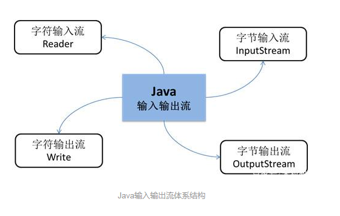

# IO 流

Java 相关的文件输入输出都是通过IO 流来完成的。相关的文件输入、输出流都在Java.io 包中。

而IO 流主要分为以下两类：

+ 输入流：是从文件读取数据，是一个拉取数据的过程

+ 输出流：是将数据写入到文件，是一个推送数据的过程

Java 所提供的输入流和输出流类封装在Java.io包中，Java 输入输出流的体系结构如下图所示：


从图中可以看出，Reader和Write为字符输入输出流，InputStream和OutputStream为字节输入输出流。

## 输入流
输入流按照读取数据单位可分为字节流和字符流，字节流是以字节为单位传输数据的流，字符流是以字符为单位传输数据的流。主要分类为：

+ InputStream 类，字节输入流

+ Reader 类，字符输入流

### InputStream 类 

InputStream 类是抽象类，无法直接使用，它的具体实现类主要是以下几种：
+ FileInputStream类：该类以字节为单位从文件中读取数据。

+ ByteArrayInputStream类：该类在内存中创建一个字节数组缓冲区，从输入流读取的数据保存在该字节数组缓冲区中。

+ ObjectInputStream类：该类从输入流读入对象，读取对象信息。

#### 常用方法
|方法名  |  作用描述|
|---| ---|
|read() | 该方法用于从输入流中读取数据的下一个字节，返回读到的字节值，若遇到流的末尾，返回-1|
|read(byte[] b) | 该方法用于从输入流中读取b.length个字节的数据，并将数据存储到缓冲区数组b中，返回的是实际读到的字节数。|
|read(byte[] b,int off,int len) | 该方法用于从输入流中读取len个字节的数据，并从数组b的off位置开始写入到这个数组中 |
|close() |关闭此输入流，并释放与此输入流相关联的所有系统资源 |

### Reader 类

Reader 类的具体实现类为以下几种：
+ InputStreamReader类：该类从数据源读取字节并将其解码为使用指定的字符集的字符。

+ FileReader类：该类继承于InputStreamReader，用于读取字符类文件，如文本文件。

+ BufferedReader类：该类用于将缓冲区中的数据以字符为单位读取。

#### 常用方法

|方法名  |  作用描述|
|---| ---|
|read(int b) | 该方法用于读取单个字符，返回作为整数读取的字符，如果已经到达流的末尾，返回-1 |
|read(char[] cbuf)       | 该方法用于将字符读入到cbuf，返回读取的字符数 |
|read(char[] cbuf,int off,int len) | 该方法用于读取len个字符的数据，并从数组cbuf的off位置读入到这个数组中|
|close() | 关闭此输入流，并释放与此输出流相关联的所有系统资源 |

## 输出流

同输入流一样，根据输出数据单位可分为字节流和字符流，主要分类为：

+ OutputStream 类，字节输出流

+ Writer 类，字符输出流

### OutputStream 类

OutputStream 类的具体实现类主要是以下几种：
+ FileOutputStream类：该类以字节为单位将数据写入到文件。

+ ByteArrayOutputStream类：该类在内存中创建一个字节数组缓冲区，所有发送到输出流的数据保存在该字节数组缓冲区中。

+ ObjectOutputStream类：该类将对象信息写入到输出流。

#### 常用方法
|方法名  |  作用描述|
|---| ---|
|write(int b)  | 该方法用于将指定的字节写入到输出流 |
|write(byte[] b) | 该方法用于将b.length个字节从指定的byte数组写入到输出流 |
|write(byte[] b,int off,int len) | write(byte[] b,int off,int len) |
|close() | 关闭此输出流，并释放与此输出流相关联的所有系统资源 |

### Writer 类

Writer 类的具体实现类主要是以下几种：
+ OutputStreamWriter类：该类将输出的字符流变为字节流，即将一个字符流的输出对象变为字节流的输出对象。

+ FileWriter类：该类从 OutputStreamWriter 类继承而来。该类按字符向字符类文件写入数据。

+ BufferedWriter类：该类用于将文本写入字符输出流，缓冲各个字符，从而提供单个字符，数组和字符串的高效写入。

#### 常用方法
|方法名  |  作用描述|
|---| ---|
|write(int b) | 该方法用于向数据源写入单个字符 |
|write (char[] cbuf) | 该方法用于向数据源写入字符数组 |
|write (char[] cbuf,int off,int len) | 该方法用于向数据源写入len个字符数据，并从数组cbuf的off位置开始 |
|write (String str) | 该方法用于向数据源写入字符串 |
|flush() | 刷新该输出流的缓冲，将缓冲的数据全部写入到数据源 |
|close() | 关闭此输出流，关闭之前需先调用flush() |

## 示例

``` java
//通过FileInputStream、FileOutputStream实现文件读写
File file = new File("test.txt");

//isDirectory()判断file是否是文件夹
    if(file.isFile() && file.exists()){
    //存在先删除文件
    file.delete();
}
FileOutputStream fos = null;
OutputStreamWriter osw = null;
try {
    //构建FileOutputStream，文件file不存在时会先创建
    fos = new FileOutputStream(file);
    
    //设置编码格式，防止乱码
    osw = new OutputStreamWriter(fos, "utf-8");
    
    //通过append()方法写入内容
    osw.append("这是一个测试文件...");
    
    //换行
    osw.append("\r\n");
    
    osw.append("This is a test!");
} catch (IOException e) {
    e.printStackTrace();
} finally {
    //释放资源
    if (osw != null) {
        try {
            osw.close();
        } catch (IOException e) {
            e.printStackTrace();
        }
    }
    if (fos != null) {
        try {
            fos.close();
        } catch (IOException e) {
            e.printStackTrace();
        }
    }
}


//读取test.txt中的文件
FileInputStream fis = null;

InputStreamReader isr = null;

BufferedReader br = null;

try {
    fis = new FileInputStream(file);
    
    //设置编码格式
    isr = new InputStreamReader(fis, "utf-8");
    
    br = new BufferedReader(isr);
    String content = null;
    while((content = br.readLine()) != null) {
        System.out.println(content);
    }
} catch (IOException e) {
    e.printStackTrace();
} finally {
    //释放资源
    if (br != null) {
        try {
            br.close();
        } catch (IOException e) {
            e.printStackTrace();
        }
    }
    if (isr != null) {
        try {
            isr.close();
        } catch (IOException e) {
            e.printStackTrace();
        }
    }
    if (fis != null) {
        try {
            fis.close();
        } catch (IOException e) {
            e.printStackTrace();
        }
    }
}
```