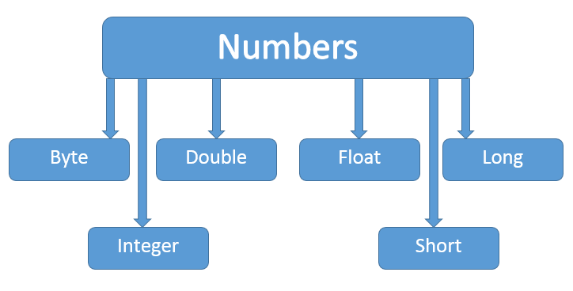
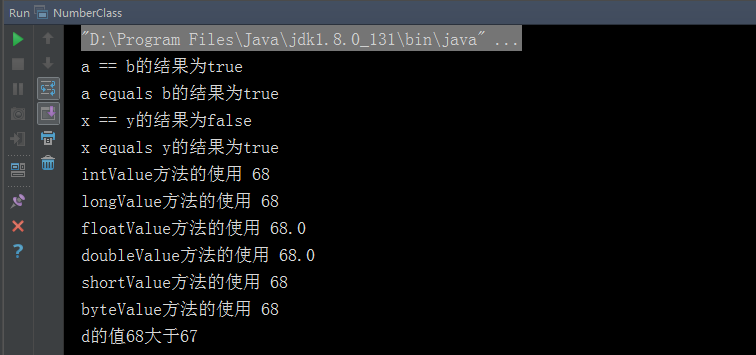

# Number 类

当我们使用数字类型是，一般都是直接使用基本类型`int、short、long、double、float`等等，但是其实Java 
中有这些内置基本类型对应的包装类型`Integer、Short、Long、Double、Float`等。基本类型都是直接存储在栈内存的，而包装类型和其他类一样都是存储在堆内存。
包装类型是为了避免强制转换出错而更好的使用基本类型而封装的类型，操作包装类型可以像操作其他类型一样直接使用。抽象Number类是所有包装类型的父类。

## Number类与包装类的继承关系



## 基本类型和包装类型的区别

+ 基本类型可以直接使用，包装类型必须通过new来创建

+ 基本类型存储在栈内存中，包装类型存储在堆内存中，通过存在栈内存里的引用使用

+ 基本类型的初始值数字型都是0，而包装类型属于引用类型所以初始值为Null

+ 集合类型不允许存储基本类型，只能使用包装类型

## 示例
``` java
//Java 会对 -128 ~ 127 的整数进行缓存，
// 所以当定义两个变量初始化值位于 -128 ~ 127 之间时，
//两个变量使用了同一地址
int a = 34;
Integer b = new Integer(34);
System.out.println("a == b的结果为" + (a == b));
System.out.println("a equals b的结果为" + (b.equals(a)));
//==比较的是内存地址，equals比较的是对象的内容
Integer x = 200;
Integer y = 200;
System.out.println("x == y的结果为" + (x == y));
System.out.println("x equals y的结果为" + (y.equals(x)));

//自动拆箱 使用包装类型进行计算的时候，包装类型会转换为对应的基本类型，称为拆箱
int c = a + b;
//自动装箱 将基本类型变量值赋给包装类型变量的时候，会自动转换为对应的包装类型，称为装箱
Integer d = c;

//Number抽象类的方法  xxxValue返回对应的xxx基本类型数据
System.out.println("intValue方法的使用 " + d.intValue());
System.out.println("longValue方法的使用 " + d.longValue());
System.out.println("floatValue方法的使用 " + d.floatValue());
System.out.println("doubleValue方法的使用 " + d.doubleValue());
System.out.println("shortValue方法的使用 " + d.shortValue());
System.out.println("byteValue方法的使用 " + d.byteValue());

//比较两个数的大小 指定数大于参数返回1，等于返回0，小于返回-1
switch(d.compareTo(67)) {
    case -1:
        System.out.println("d的值" + d + "小于67");
        break;
    case 0:
        System.out.println("d的值" + d + "等于67");
        break;
    case 1:
        System.out.println("d的值" + d + "大于67");
        break;
}
```

#### 结果：

