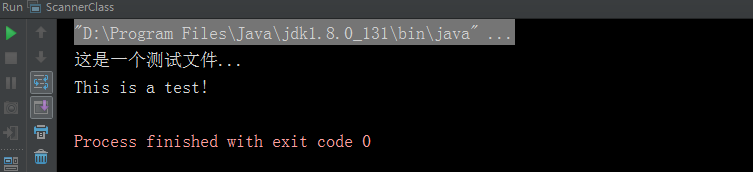

# Scanner 类

java.util.Scanner 是 Java5 的新特征，可以通过 Scanner 类来获取用户的输入或者读取文件内容。

## 使用方式

下面是创建 Scanner 对象的基本语法：
``` java
//获取用户输入
Scanner scanner = new Scanner(System.in);
``` 

## 常用方法

|方法名  |  作用描述|
|---| ---|
|hasNext() | 判断是否还有输入，如果有返回true，否则返回false |
|hasNextInt() | 判断下一个输入是否为int 类型，如果是返回true，否则返回false |
|hasNextFloat() | 判断下一个输入是否为float 类型，如果是返回true，否则返回false |
|hasNextLine() | 判断是否还有下一行字符串数据输入，如果是返回true，否则返回false |
|nextInt() | 读取下一个int 类型的输入数据 |
|nextFloat() | 读取下一个float 类型的输入数据 |
|next() | 读取下一个字符串输入数据 |
|nextLine() | 读取下一行字符串输入数据 |

``` java
//获取用户输入
Scanner scanner = new Scanner(System.in);

System.out.println("请输入数据：");

//hasNext()方法判断是否还有输入
if (scanner.hasNext()) {

    //判断输入的是否为整数
    if (scanner.hasNextInt()) {
        int num = scanner.nextInt();
        System.out.println("输入的整数为：" + num);
    } else if (scanner.hasNextFloat()) { //判断输入的是否为小数
        float num = scanner.nextFloat();
        System.out.println("输入的小数位：" + num);

    }
    //获取输入数据 next()方法不包含空格的字符串
    String str = scanner.next();
    //输入 Jordan Zhang
    System.out.println("输入的是：" + str); //结果是：输入的是：Jordan

    //nextLine()获取一行数据  可以包含空格
    //String str = scanner.nextLine();
    //System.out.println("输入的是：" + str); //结果是：输入的是：Jordan Zhang
}

scanner.close();
```

## next() 与 nextLine() 区别

#### next()：

+ 一定要读取到有效字符后才可以结束输入。

+ 对输入有效字符之前遇到的空白，next() 方法会自动将其去掉。

+ 只有输入有效字符后才将其后面输入的空白作为分隔符或者结束符。

+ next() 不能得到带有空格的字符串。

#### nextLine()：

+ 以Enter为结束符,也就是说 nextLine()方法返回的是输入回车之前的所有字符。

+ 可以获得空白。

## 文件操作

Scanner 不仅能从输入流中读取，也能从文件中读取，除了构建 Scanner 对象的方法，其他和上文给出的完全相同，以下案例从一个名为 test.txt 的文件中读取整数。


test.txt 文件内容：
```text
这是一个测试文件...
This is a test!
```

读取文件操作如下：
``` java
//Scanner类读取文件内容
File file = new File("test.txt");
Scanner scanner = null;

//判断文件是否存在而有内容
if (file.exists() && file.isFile() && file.length() != 0) {
    try {
        scanner = new Scanner(file);

        //循环读取下一行内容
        while (scanner.hasNextLine()) {
            String content = scanner.nextLine();
            System.out.println(content);
        }
    } catch (FileNotFoundException e) {
        e.printStackTrace();
    } finally {
        if (scanner != null) {
            scanner.close();
        }
    }
}
```

结果：
