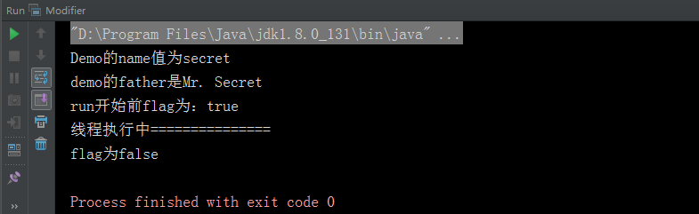

# 修饰符

Java 修饰符是用来修饰类、方法、变量等的[关键字](/grammer/keyword)，主要分访问权限修饰符和非访问权限修饰符两种。

## 访问权限修饰符 :id=access-permission

了解访问修饰符前先要搞清楚，访问修饰符使用来干什么的，顾名思义是用来控制Java 类的访问权限的。
为什么要控制java类的访问权限？当我们创建一个Java 工程的时候如果引用了第三方类库，里面有和我们自己同名的Java类的时候，如果
没有区分，程序就分不清楚到底是引用那个Java 类了，而区分Java 类用的是package[关键字](/grammer/keyword)，
package 路径区分Java 类的唯一性，虚拟机编译执行Java 文件的时候，就是根据配置的classpath 寻找package 路径下的Java 文件，
进行编译执行的，而访问权限修饰符就是控制Java 类的访问权限,根据修饰符不同Java 类在不同包或者同包下的能否使用也就不同。

#### 分类

+ `private：`只有同类里可见，主要是用来定义属性，私有方法，Java 封装特性的体现，隐藏内部细节。

+ `default：`默认访问权限，什么也不写，表示同包可见。

+ `protect：`表示同包的类和所有子类可见，子类概念后面讲继承的时候会讲。

+ `public：`表示类可见。

#### 使用范围比较：

| 使用范围 |  private |  默认访问权限 | protect | public |
|:--:|:--:|:--:|:--:|:--:|
| 类内部 | 是 | 是 | 是 | 是 |
| 相同包中子类 | 否 | 是 | 是 | 是 |
| 相同包中的非子类 | 否 | 是 | 是 | 是 |
| 不同包中的子类 | 否 | 否 | 是 | 是 |
| 不同包中的非子类子类 | 否 | 否 | 否 | 是 |

!> **注意项：** 1. 父类中声明为public 的方法在子类中也必须为public的方法。<br/>&emsp;&emsp;&emsp;&emsp;&nbsp;2. 父类声名的protect 的方法在子类中要么是protect 要么是public 修饰的方法。<br/>&emsp;&emsp;&emsp;&emsp;&nbsp;3. 父类声名为private 的方法，在子类中不能被继承。

## 非访问权限修饰符

非访问权限修饰符指的就是Java 中除了几个访问权限修饰符以外的，用来修饰类、方法、变量等的[关键字](/grammer/keyword)。

#### 分类

+ `static修饰符`

    + 用来修饰变量或者方法表示静态的
    + static修饰的变量或者方法可以使用`类名.属性名（或者方法名）`来使用
    + 静态属性存储在静态区，同一个类不管有多少实例，静态属性值只有一份
    + 静态方法不能使用类的非静态变量
    
+ `final修饰符`

    + 表示不可以改变的
    + 修饰变量的时候，表示不能重新赋值，只允许赋值一次，常和`static`一起使用表示常量
    + 修饰方法的时候，表示子类继承不允许覆盖
    
+ `abstract修饰符`

    + 表示抽象的
    + 修饰类时表示抽象类，抽象类可以有非抽象的方法，但是有抽象方法的类必须声明为抽象类
    + 修饰方法是表示抽象方法，抽象方法不能有方法体，抽象方法不能用`final`和`static`修饰
    
    !> 注意：继承抽象类的子类必须实现所有父类的抽象方法，除非子类也是抽象类。
    
+ `synchronized修饰符`

    + 表示同步的，修饰方法表示同一时间只允许一个线程访问
    
+ `transient修饰符`

    + 当Java 类进行序列化的时候，被修饰的成员变量会被忽视
    
+ `volatile修饰符`

    + 修饰变量时都强制从共享内存中重新读取该成员变量的值，而且当成员变量发生变化时，会强制线程将变化值回写到共享内存，这样在任何时刻，两个不同的线程总是看到某个成员变量的同一个值
    
#### 示例

``` java
public class Modifier {

    public static void main(String [] args) {

        System.out.println("Demo的name值为" + AbstractDemo.getName());

        System.out.println("demo的father是" + AbstractDemo.FATHER);

        final VolatileTest volatileTest = new VolatileTest();
        Thread thread1 = new Thread(volatileTest);
        Thread thread2 = new Thread(new Runnable() {
            @Override
            public void run() {
                volatileTest.stop();
            }
        });

        thread1.start();
        thread2.start();

    }
}

//抽象类
abstract class AbstractDemo {

    //私有属性
    private static String name = "secret";

    //默认属性
    int age;

    //受保护的属性
    protected boolean isKind;

    //公开属性
    public String interest;

    public final double height = 1.72;

    public final static String FATHER = "Mr. Secret";

    public static String getName() {
        return name;
    }

    public void changeHeight() {
        //height = 1.87; 这样会提示无法修改final属性。
    }

    //抽象方法
    abstract void sing();
}

class VolatileTest implements Runnable{
    
    private volatile boolean flag;

    public void run() {
        flag = true;
        System.out.println("run开始前flag为：" + flag);
        while (flag) {
            //线程执行中
            System.out.println("线程执行中===============");
        }
    }

    public void stop() {
        flag = false;
        System.out.println("flag为" + flag);
    }
}
```

#### 结果

