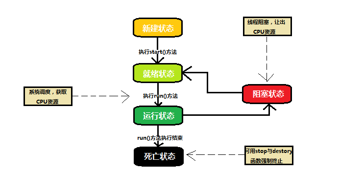

# 多线程

Java 代码是顺序执行的代码，执行由一个进程管理，进程由操作系统分配的内存空间，包含一个或多个线程。一个线程不能独立的存在，它必须是进程的一部分，
进程启动后一直运行，直到所有的非守护线程都结束运行后才能结束。

## 生命周期

线程的生命周期：新建态 -> （阻塞态） -> 就绪态 -> 运行态 -> 死亡态。

+ 新建态：线程创建之后就处于新建态，知道程序start() 启动这个线程。

+ 就绪态：线程调用start()方法启动后进入就绪态，知道JVM里线程调度器的调度。

+ 运行态：就绪线程获得CPU资源后，执行run()方法进入运行态。

+ 阻塞态：线程执行sleep()休眠、suspend（挂起）等方法失去系统资源进入阻塞态，重新获取资源后进入就绪态。当sleep() 状态超时，join() 等待线程终止或超时，或者 I/O 处理完毕，线程重新转入就绪状态。

    阻塞态的三种类型：

    + 等待阻塞：运行状态中的线程执行 wait() 方法，使线程进入到等待阻塞状态。

    + 同步阻塞：线程在获取 synchronized 同步锁失败(因为同步锁被其他线程占用)。

    + 其他阻塞：通过调用线程的 sleep() 或 join() 发出了 I/O 请求时，线程就会进入到阻塞状态。

+ 死亡态：线程任务完成或者其他终止条件发生进入死亡态。



## 优先级

线程优先级,其取值范围是 1 （Thread.MIN_PRIORITY ） - 10 （Thread.MAX_PRIORITY ）；默认优先级 NORM_PRIORITY（5）；优先级高的应该会在优先级低的之前获取到系统资源，但是并不能保证线程执行顺序。

多线程并行执行而不是顺序执行，所以使用多线程需要注意几个点：

+ 线程同步安全、线程通信、线程死锁、线程控制（休眠、挂起、停止和恢复）。

+ 多线程编程并不是线程越多越好，线程越多CPU上下文切换的时间花费的越多，资源占用越多。

## Thread 类的构造函数

Thread 类有下面这些构造函数：

+ 无参构造函数，创建一个新线程。

``` java
Thread()
```

+ 指定线程目标的创建新线程。

``` java
Thread(Runnable target)
```

+ 指定线程目标和线程名的创建新线程

``` java
Thread(Runnable target, String name)
```

+ 创建指定线程名的新线程。

``` java
Thread(String name)
```

+ 创建指定线程组和线程目标的新线程。

``` java
Thread(ThreadGroup group, Runnable target)
```

+ 创建指定线程组、线程目标和线程名的新线程。

``` java
Thread(ThreadGroup group, Runnable target, String name)
```

+ 创建指定线程组、线程目标和线程名,并具有指定的堆栈大小的新线程。

``` java
Thread(ThreadGroup group, Runnable target, String name, long stackSize)
```

+ 创建指定线程组和线程名的新线程。

``` java
Thread(ThreadGroup group, String name)
```

## Thread 常用方法

|方法名  |  作用描述|
|---| ---|
|void start() | 使该线程开始执行；Java 虚拟机调用该线程的 run 方法 |
|void run() | 如果该线程是使用独立的 Runnable 运行对象构造的，则调用该 Runnable 对象的 run 方法；否则，该方法不执行任何操作并返回 |
|final void setName(String name) | 改变线程名称，使之与参数 name 相同|
|final void setPriority(int priority) | 更改线程的优先级 |
|final void setDaemon(boolean on) | 将该线程标记为守护线程或用户线程 |
|final void join(long millisec) | 等待该线程终止的时间最长为 millis 毫秒|
|void interrupt() | 中断线程 |
|final boolean isAlive() | 测试线程是否处于活动状态 |
|static void yield() | 暂停当前正在执行的线程对象，并执行其他线程 |
| static void sleep(long millisec) | 在指定的毫秒数内让当前正在执行的线程休眠（暂停执行），此操作受到系统计时器和调度程序精度和准确性的影响|
|static boolean holdsLock(Object x) | 当且仅当当前线程在指定的对象上保持监视器锁时，才返回 true|
|static Thread currentThread() | 返回对当前正在执行的线程对象的引用 |
|static void dumpStack() | 将当前线程的堆栈跟踪打印至标准错误流|

## 创建线程

创建线程的三种方式：

+ 实现Runnable接口。

+ 继承Thread类。

+ 通过 Callable 和 Future 创建线程。

三种方式比较：

+ 实现Runnable/Callable接口的方式更具有扩展性，可以实现其他接口或者继承类。

+ 继承Thread类的方式使用简单，获取当前线程直接通过this，无需使用 Thread.currentThread() 方法。

#### 实现Runnable接口

实现Runnable接口，是最简单的创建线程的方法。实现Runnable接口，必须实现run()方法：

``` java
public void run();
```

通过指定线程目标的方式创建新线程后，调用`start()`方法启动线程。

##### 示例

``` java
class RunnableDemo implements Runnable {

    private String name;

    private Thread thread;

    public RunnableDemo(String name) {
        this.name = name;
    }

    @Override
    public void run() {
        System.out.println("实现了Runnable接口的类" + name);
        try {
            for(int i = 0; i < 5; i++) {
                System.out.println(name + "线程：" + i);
                // 让线程睡眠一会
                Thread.sleep(50 * i);
            }
        } catch (InterruptedException e) {
            e.printStackTrace();
            System.out.println(name + "线程被打断");
        }
    }

    public void start() {
        System.out.println("启动线程类 " + this.name);
        if(thread == null) {
            thread = new Thread(this, name);
            //使该线程开始执行；Java 虚拟机调用该线程的 run 方法。
            thread.start();
        }
    }
}

public class TestThread {

   public static void main(String args[]) {
      RunnableDemo R1 = new RunnableDemo( "Thread-1");
      R1.start();

      RunnableDemo R2 = new RunnableDemo( "Thread-2");
      R2.start();
   }
}
```

#### 继承Thread类

创建一个线程的第二种方法是创建一个新的类，该类继承 Thread 类，然后创建一个该类的实例。继承类必须重写 run() 方法，该方法是新线程的入口点。它也必须调用 start() 方法才能执行。

##### 示例

``` java
class ThreadChild extends Thread {

    private String name;

    private Thread thread;

    public ThreadChild(String name) {
        this.name = name;
    }

    @Override
    public void run() {
        System.out.println("继承了Thread的子类" + name);
        try {
            for(int i = 0; i < 5; i++) {
                System.out.println(name + "线程：" + i);
                // 让线程睡眠一会
                Thread.sleep(50 * i);
            }
        } catch (InterruptedException e) {
            e.printStackTrace();
            System.out.println(name + "线程被打断");
        }
    }

    public void start() {
        System.out.println("启动线程类 " + this.name);
        if(thread == null) {
            thread = new Thread(this, name);
            //改变线程名称，使之与参数 name 相同。
            thread.setName(name);
            //将该线程标记为守护线程或用户线程。
            thread.setDaemon(true);
            //更改线程的优先级。
            thread.setPriority(Thread.MAX_PRIORITY);
            thread.start();
        }
    }
}

public class TestThread {

   public static void main(String args[]) {
      ThreadChild T1 = new ThreadChild( "Thread-1");
      T1.start();

      ThreadChild T2 = new ThreadChild( "Thread-2");
      T2.start();
   }
}
```

#### 通过 Callable 和 Future 创建线程

1. 创建 Callable 接口的实现类，并实现 call() 方法，该 call() 方法将作为线程执行体，并且有返回值。

2. 创建 Callable 实现类的实例，使用 FutureTask 类来包装 Callable 对象，该 FutureTask 对象封装了该 Callable 对象的 call() 方法的返回值。

3. 使用 FutureTask 对象作为 Thread 对象的 target 创建并启动新线程。

4. 调用 FutureTask 对象的 get() 方法来获得子线程执行结束后的返回值。

##### 示例

``` java
class CallableThreadDemo implements Callable<Integer> {

    private String name;

    public CallableThreadDemo(String name) {
        this.name = name;
    }

    @Override
    public Integer call() throws Exception {
        System.out.println("通过 Callable 和 Future 创建线程" + name);
        int i = 10;
        for(; i < 15; i++) {
            System.out.println(Thread.currentThread().getName() + " " + i);
        }
        return i;
    }

    public static void main(String[] args) {
        CallableThreadDemo ctd = new CallableThreadDemo("CallableThreadDemo");
        FutureTask<Integer> ft = new FutureTask<>(ctd);
        for(int i = 0; i < 5; i++) {
            System.out.println(Thread.currentThread().getName() + " 的循环变量i的值" + i);
            if(i == 3) {
                new Thread(ft, "有返回值的线程").start();
            }
        }
        try {
            System.out.println("子线程的返回值：" + ft.get());
        } catch (InterruptedException e) {
            e.printStackTrace();
        } catch (ExecutionException e) {
            e.printStackTrace();
        }
    }
}
```