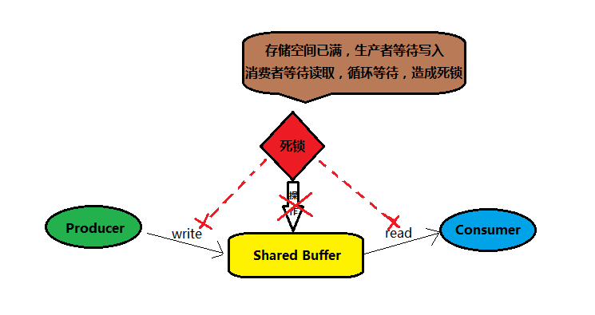
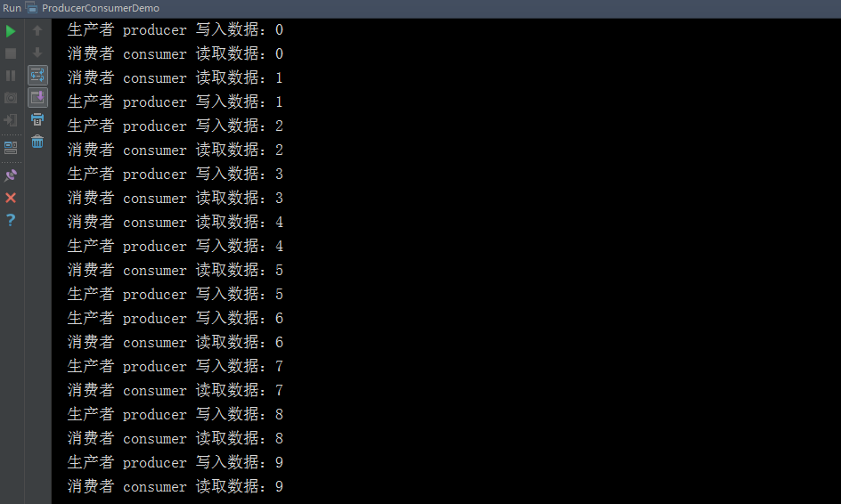

# 生产者/消费者问题

生产者/消费者问题是生产者和消费者在同一时间段内共用同一个存储空间，生产者向空间里存放数据；而消费者取用数据；如果不加以协调可能会造成死锁。

比如：存储空间已满，而生产者占用着它，消费者等着生产者让出空间从而去除产品，生产者等着消费者消费产品，从而向空间中添加产品。互相等待，从而发生死锁。




## 解决方案

生产者/消费者问题可以通过多线程同步进行解决：

``` java
public class ProducerConsumerDemo {

    public static void main(String [] args) {
        //多线程同步解决生产者、消费者问题
        PublicSpace c = new PublicSpace();
        Producer producer = new Producer(c, "producer");
        Consumer consumer = new Consumer(c, "consumer");

        //启动线程
        producer.start();
        consumer.start();
    }
}

//生产者
class Producer extends Thread {

    //公共内容区
    private PublicSpace contents;

    private String name;

    public Producer(PublicSpace c, String name) {
        contents = c;
        this.name = name;
    }

    public void run() {
        for(int i = 0; i < 10; i++) {
            contents.write(i);
            System.out.println("生产者 " + this.name + " 写入数据：" + i);
            try {
                //线程休眠一段时间
                sleep((int) (Math.random() * 100));
            } catch (InterruptedException e) {
            }
        }
    }
}


//消费者
class Consumer extends Thread {

    //公共内容区
    private PublicSpace contents;

    private String name;

    public Consumer(PublicSpace c, String name) {
        contents = c;
        this.name = name;
    }
    public void run() {
        int value = 0;
        for (int i = 0; i < 10; i++) {
            value = contents.read();
            System.out.println("消费者 " + this.name+ " 读取数据：" + value);
        }
    }
}

//公共访问存储空间
class PublicSpace {

    //存储内容
    private int contents;

    //判断空间是否可用
    private boolean available = false;

    //同步方法读取存储内容
    public synchronized int read() {
        //判断当前存储空间是否可用
        while (available == false) {
            try {
                //线程等待
                wait();
            }
            catch (InterruptedException e) {
            }
        }
        available = false;
        //唤醒线程
        notifyAll();
        return contents;
    }

    //同步方法写入存储内容
    public synchronized void write(int value) {
        //判断当前存储空间是否可用
        while (available == true) {
            try {
                //线程等待
                wait();
            }
            catch (InterruptedException e) {
            }
        }
        //公共空间写入数据
        contents = value;
        available = true;
        //唤醒线程
        notifyAll();
    }
}
```

#### 结果


