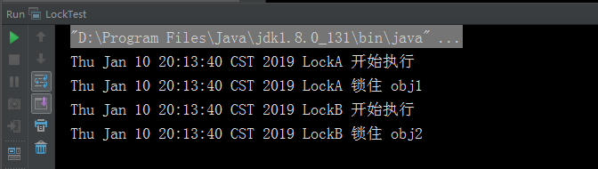
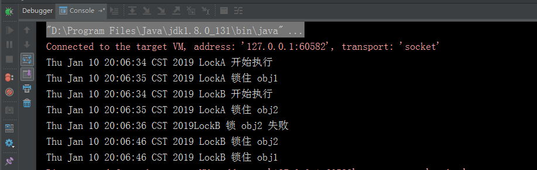

# 死锁问题

Java 使用多线程开发，同时操作资源，某个线程占用资源因阻塞无法释放资源而其他线程等待被占用的资源造成死锁。

## 产生条件

死锁产生的四个必要条件：

+ 互斥使用，即当资源被一个线程使用(占有)时，别的线程不能使用。

+ 不可抢占，资源请求者不能强制从资源占有者手中夺取资源，资源只能由资源占有者主动释放。

+ 请求和保持，即当资源请求者在请求其他的资源的同时保持对原有资源的占有。

+ 循环等待，即存在一个等待队列：P1占有P2的资源，P2占有P3的资源，P3占有P1的资源。这样就形成了一个等待环路。

## 解决方案

解决死锁方法：一种是用synchronized，一种是用Lock显式锁实现。 但是不恰当的使用锁且出现同时要锁多个对象时，也会造成死锁情况，如下：

``` java
public class LockDemo {

    public static String obj1 = "obj1";

    public static String obj2 = "obj2";

    public static void main(String[] args) {
        LockA la = new LockA();
        new Thread(la).start();
        LockB lb = new LockB();
        new Thread(lb).start();
    }
}
class LockA implements Runnable{
    public void run() {
        try {
            System.out.println(new Date().toString() + " LockA 开始执行");
            while(true){
                synchronized (LockTest.obj1) {
                    System.out.println(new Date().toString() + " LockA 锁住 obj1");
                    Thread.sleep(3000); // 此处等待是给B能锁住机会
                    synchronized (LockTest.obj2) {
                        System.out.println(new Date().toString() + " LockA 锁住 obj2");
                        Thread.sleep(60 * 1000); // 为测试，占用了就不放
                    }
                }
            }
        } catch (Exception e) {
            e.printStackTrace();
        }
    }
}
class LockB implements Runnable{
    public void run() {
        try {
            System.out.println(new Date().toString() + " LockB 开始执行");
            while(true){
                synchronized (LockTest.obj2) {
                    System.out.println(new Date().toString() + " LockB 锁住 obj2");
                    Thread.sleep(3000); // 此处等待是给A能锁住机会
                    synchronized (LockTest.obj1) {
                        System.out.println(new Date().toString() + " LockB 锁住 obj1");
                        Thread.sleep(60 * 1000); // 为测试，占用了就不放
                    }
                }
            }
        } catch (Exception e) {
            e.printStackTrace();
        }
    }
}
```

#### 结果



## Semaphore 类

为了解决这个问题，我们不使用显示的去锁，我们用信号量（Semaphore 类）去控制。信号量可以控制资源能被多少线程访问，这里我们指定只能被一个线程访问，就做到了类似锁住。而信号量可以指定去获取的超时时间，我们可以根据这个超时时间，去做一个额外处理。
对于无法成功获取的情况，一般就是重复尝试，或指定尝试的次数，也可以马上退出。

信号量Semaphore有两种模式：

+ 公平模式：公平模式就是调用acquire的顺序就是获取许可证的顺序，遵循FIFO。

+ 非公平模式：非公平模式是抢占式的，也就是有可能一个新的获取线程恰好在一个许可证释放时得到了这个许可证，而前面还有等待的线程。

## 示例

``` java
public class UnLockDemo {

    public static String obj1 = "obj1";

    public static final Semaphore a1 = new Semaphore(1);

    public static String obj2 = "obj2";

    public static final Semaphore a2 = new Semaphore(1);

    public static void main(String [] args) {
        LockA lockA = new LockA();
        new Thread(lockA).start();
        LockB lockB = new LockB();
        new Thread(lockB).start();
    }
}


class LockA implements Runnable {

    @Override
    public void run() {
        try {
            System.out.println(new Date().toString() + " LockA 开始执行");
            while (true) {
                //超时1s中之后尝试重新获取许可
                if (UnLockDemo.a1.tryAcquire(1, TimeUnit.SECONDS)) {
                    System.out.println(new Date().toString() + " LockA 锁住 obj1");

                    if (UnLockDemo.a2.tryAcquire(1, TimeUnit.SECONDS)) {
                        System.out.println(new Date().toString() + " LockA 锁住 obj2");
                        Thread.sleep(60 * 1000); // do something
                    }else{
                        System.out.println(new Date().toString() + "LockA 锁 obj2 失败");
                    }
                }else{
                    System.out.println(new Date().toString() + "LockA 锁 obj1 失败");
                }
                // 释放资源
                UnLockDemo.a1.release();
                UnLockDemo.a2.release();
                // 马上进行尝试，现实情况下do something是不确定的
                Thread.sleep(1000);
            }
        } catch (Exception e) {
            e.printStackTrace();
        }
    }
}

class LockB implements Runnable {
    public void run() {
        try {
            System.out.println(new Date().toString() + " LockB 开始执行");
            while (true) {
                //超时1s中之后尝试重新获取许可
                if (UnLockDemo.a2.tryAcquire(1, TimeUnit.SECONDS)) {
                    System.out.println(new Date().toString() + " LockB 锁住 obj2");
                    if (UnLockDemo.a1.tryAcquire(1, TimeUnit.SECONDS)) {
                        System.out.println(new Date().toString() + " LockB 锁住 obj1");
                        Thread.sleep(60 * 1000); // do something
                    }else{
                        System.out.println(new Date().toString() + "LockB 锁 obj1 失败");
                    }
                }else{
                    System.out.println(new Date().toString() + "LockB 锁 obj2 失败");
                }
                // 释放资源
                UnLockDemo.a1.release();
                UnLockDemo.a2.release();
                // 这里只是为了演示，所以tryAcquire只用1秒
                //而且B要给A让出能执行的时间，否则两个永远是死锁
                Thread.sleep(10 * 1000);
            }
        } catch (Exception e) {
            e.printStackTrace();
        }
    }
}
```

#### 结果




!> 关于Semaphore 类的更多知识可以查看我的博客[Semaphore源码解析](http://www.blackj.site/2018/11/16/Semaphore%E6%BA%90%E7%A0%81%E8%A7%A3%E6%9E%90/)