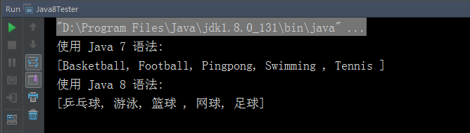

# JAVA 8 新特性

Java 8 (又称为 jdk 1.8) 是 Java 语言开发的一个主要版本。 Oracle 公司于 2014 年 3 月 18 日发布 Java 8 ，它支持函数式编程，新的 JavaScript 引擎，新的日期 API，新的Stream API 等。

## 新特性

Java8 新增了非常多的特性，我们主要讨论以下几个：

+ Lambda 表达式 − Lambda允许把函数作为一个方法的参数（函数作为参数传递进方法中。

+ 方法引用 − 方法引用提供了非常有用的语法，可以直接引用已有Java类或对象（实例）的方法或构造器。与lambda联合使用，方法引用可以使语言的构造更紧凑简洁，减少冗余代码。

+ 默认方法 − 默认方法就是一个在接口里面有了一个实现的方法。

+ 新工具 − 新的编译工具，如：Nashorn引擎 jjs、 类依赖分析器jdeps。

+ Stream API −新添加的Stream API（java.util.stream） 把真正的函数式编程风格引入到Java中。

+ Date Time API − 加强对日期与时间的处理。

+ Optional 类 − Optional 类已经成为 Java 8 类库的一部分，用来解决空指针异常。

+ Nashorn, JavaScript 引擎 − Java 8提供了一个新的Nashorn javascript引擎，它允许我们在JVM上运行特定的javascript应用。

## 编程风格

Java 8 希望有自己的编程风格，并与 Java 7 区别开，以下实例展示了 Java 7 和 Java 8 的编程格式：

``` java
public class Java8Tester {

    public static void main(String args[]){

        List<String> spots = new ArrayList<String>();
        spots.add("Football");
        spots.add("Basketball");
        spots.add("Tennis ");
        spots.add("Swimming ");
        spots.add("Pingpong");

        List<String> spots_zh = new ArrayList<String>();
        spots_zh.add("足球");
        spots_zh.add("篮球 ");
        spots_zh.add("网球");
        spots_zh.add("游泳");
        spots_zh.add("乒乓球");

        Java8Tester tester = new Java8Tester();
        System.out.println("使用 Java 7 语法: ");
        tester.sortUsingJava7(spots);
        System.out.println(spots);

        System.out.println("使用 Java 8 语法: ");
        tester.sortUsingJava8(spots_zh);
        System.out.println(spots_zh);
    }

    // 使用 java 7 排序
    private void sortUsingJava7(List<String> names){
        Collections.sort(names, new Comparator<String>() {
            @Override
            public int compare(String s1, String s2) {
                return s1.compareTo(s2);
            }
        });
    }

    // 使用 java 8 排序
    private void sortUsingJava8(List<String> names){
        Collections.sort(names, (s1, s2) -> s1.compareTo(s2));
    }
}
```

#### 结果


!> 关于Java 8新特性的更多知识可以查看菜鸟教程[Java 8新特性](http://www.runoob.com/java/java8-new-features.html)。

