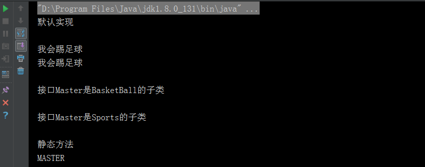

# 接口

Java 接口是一系列抽象方法的集合，用来描述一些方法的公共性。

## 定义

接口通过关键字`interface`定义，由于只描述公共方法的抽象概念，并不需要具体的实现，所以接口中方法都是默认抽象的。
``` java
[可见度] interface 接口名称 [extends 其他的接口名] {
    // 声明变量 public static final
    // 抽象方法
}
```

接口中有一种特殊接口，称为标记接口，标记接口没有包含任何方法的接口，只是用来标记某个公共性。
``` java
[可见度] interface 接口名称{
    // 没有抽象方法
}
```

在 JDK1.8，允许我们给接口添加两种非抽象的方法实现：

+ 默认方法，添加 default 修饰即可，通过接口实现类的对象来调用。

+ 静态方法，使用 static 修饰，静态方法只能通过接口名调用。
``` java
[可见度] interface 接口名称{
    
    [可见度] default 返回值类型 方法名(参数列表) {
        //默认实现
    }
    
    [可见度] static 返回值类型 方法名(参数列表) {
       //默认实现
    }
}
```


## 特性

+ 接口中每一个方法也是隐式抽象的,接口中的方法会被隐式的指定为`public abstract`（只能是`public abstract`，其他修饰符都会报错）。

+ 接口中可以含有变量，但是接口中的变量会被隐式的指定为`public static final`变量（并且只能是`public`，用`private`修饰会报编译错误）。

+ 接口中的方法是不能在接口中实现的，只能由实现接口的类来实现接口中的方法。

## 使用

由于接口的抽象性，接口并不能像类一样直接实例化使用，必须通过类实现接口的方法调用,而接口的实现通过关键字`implements`完成。
``` java
public class Test {

    public static void main(String [] args) {
        Demo demo = new Demo();
        demo.sing();
    }

}

interface Dosomething {

    void sing();
}

class Demo implements Dosomething {

    @Override
    public void sing() {
        System.out.println("Do something!");
    }
    
}
``` 

#### 实现接口的注意项：

+ 类在实现接口的方法时，不能抛出强制性异常，只能在接口中，或者继承接口的抽象类中抛出该强制性异常。

+ 类在重写方法时要保持一致的方法名，并且应该保持相同或者相兼容的返回值类型。

+ 如果实现接口的类是抽象类，那么就没必要实现该接口的方法。

+ 如果实现接口的类不是抽象类，那么必须实现所以接口的所有抽象方法。

## 继承

接口之间也可以像类那样进行继承，但是与类不同的是由于接口的抽象性，使得接口更加纯粹，因而接口之间允许多继承。
``` java
interface 子接口 extends 父接口1, 父接口2,... {

}

interface 父接口1 {

}

interface 父接口2 {

} 
...
``` 

## 与抽象类的区别

|区别  |  接口| 抽象类 |
|---| ---| ---|
|使用 | 无法直接使用，只能使用实现接口的类 | 不能直接使用，只能使用继承了抽象类的非抽象子类 |
|方法 | 接口中所有方法都是抽象方法 | 抽象类中可以有非抽象方法 |
|成员变量 | 接口中只能是public static final 类型的成员变量 | 抽象类中成员变量和普通类一致 |
|继承 | 接口间允许多继承 | 抽象类是特殊的类，而类只能单继承 |

## 示例

``` java
public class InterfaceDemo {

    public static void main(String [] args) {
        InterfaceImplementsClassDemo demo = new InterfaceImplementsClassDemo();
        demo.printDefault();
        System.out.println();

        //向上转型为父类接口
        Master master = demo;
        master.playFootball();
        master.playFootball();
        System.out.println();

        if (master instanceof BasketBall) {
            System.out.println("接口Master是BasketBall的子类");
        }
        System.out.println();
        if (master instanceof Sports) {
            System.out.println("接口Master是Sports的子类");
        }
        System.out.println();

        //调用接口的静态方法
        System.out.println(Master.getName());
    }
}

//标记接口没有包含任何方法的接口 只是用来标记某个公共性
interface Sports {

}

interface BasketBall extends Sports {

    //默认就是public abstract方法
    void playBasketBall();
}

interface Football extends Sports {

    void playFootball();
}

//接口之间的多继承
interface Master extends BasketBall, Football {

    //接口只允许有 public static final 的属性  默认就是
    String NAME = "MASTER";

    //默认实现 
    default void printDefault() {
        System.out.println("默认实现");
    }

    //这个是静态方法 
    static String getName(){
        System.out.println("静态方法");
        return NAME;
    }
}

//实现Master的所有接口
class InterfaceImplementsClassDemo implements Master {

    @Override
    public void playBasketBall() {
        System.out.println("我会打篮球");
    }

    @Override
    public void playFootball() {
        System.out.println("我会踢足球");
    }
}
``` 

#### 结果：
