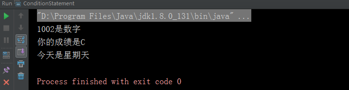

# 条件语句

条件语句就是根据某种条件判断是否要执行一段代码，条件为`true`则执行，为`false`则不执行，条件语句是Java 代码中最常用的语句之一。

## 分类

Java 中条件语句主要是以下两种：

+ `if`条件语句

+ `switch`条件语句

## if 条件语句

`if`条件语句是条件语句中主要常用的语句，主要是以下三种：

+ 单`if`条件语句

+ `if else`条件语句

+ `if else if`语句

#### 单if 条件语句

使用方式：
``` text
if (表达式） {
    //符合条件的执行代码语句。
}
``` 
如果表示式的结果是`true`则执行{}里面的语句，否则跳过{}的语句直接执行后面的语句

#### if else 条件语句

使用方式：
``` text
if (表达式）{
     //表达式为true执行后面的代码
 } else {
    //表达式为false执行后面的代码
}
```

!> 如果 `else` 后面只有一条语句可以省略{}，不过不建议这么做

#### if else if 语句
``` text
if (表达式) {
    //第一个表达式为true,执行后面的代码
} else if (表达式）{
    //第一个表达式为false,第二个表达式为true，执行后面的代码
} else if (表达式) {
   //第一、二个表达式都为false,第三个表达式为true,执行后面的代码
} else {
   //所有的表达式都为false，执行后面的代码
}
```

## switch 条件语句

注意点：

+ `switch`语句的选择数据类型只能是`byte,short,int,char`和枚举（jdk1.7版本之后）

+ `case`之间与`default`么有顺序，先判断所有`case`，没有批判的`case`则执行`default`后面的语句

+ 如果匹配的`case`或者`default`没有跟`break`结束，程序会继续执行，直到遇到`break`或则程序结束

+ `case`的值必须是相同类型的常量，不能是[变量](/grammer/variable)

#### 使用方式
``` text
swith(变量） {
    case 取值1：
         //执行语句
        break;
    case 取值2
        //执行语句
        break;
    case 取值3：
        //执行语句
        break;
         ...
    default:
        //执行语句
        break;
}
```

## 示例
``` java
Calendar today = Calendar.getInstance();
int td = today.get(today.DAY_OF_WEEK);
if ( 2 == td) {
    System.out.println("今天是星期一");
}

String num = "1002";
Pattern pattern = Pattern.compile("[0-9]*");
if (pattern.matcher(num).matches()) {
    System.out.println(num + "是数字");
} else {
    System.out.println(num + "不是数字");
}

//判断分数75的成绩
int sore = 75;
if (sore < 60) {
    System.out.println("你的成绩是E");
} else if (sore < 70) {
    System.out.println("你的成绩是D");
} else if (sore < 80) {
    System.out.println("你的成绩是C");
} else if (sore < 90){
    System.out.println("你的成绩是B");
} else {
    System.out.println("你的成绩是A");
}

//判断今天是星期几
switch (td) {
    case 1:
        System.out.println("今天是星期天");
        break;
    case 2:
        System.out.println("今天是星期一");
        break;
    case 3:
        System.out.println("今天是星期二");
        break;
    case 4:
        System.out.println("今天是星期三");
        break;
    case 5:
        System.out.println("今天是星期四");
        break;
    case 6:
        System.out.println("今天是星期五");
        break;
    case 7:
        System.out.println("今天是星期六");
        break;
    default:
        System.out.println("今天是个好天气");
        break;
}
```

结果：

