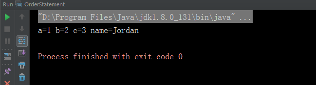

# 顺序语句

顺序语句是Java 中默认的基础语句，Java 的执行顺序是从左到右、从上到下依次执行。顺序语句就是以` ;` 分号结束的一条语句，其中没有执行代码，只有` ;` 分号的语句称为空语句。

## 示例

``` java
public class OrderStatement {

    public static void main(String [] args) {

        //变量声名语句
        int a = 1, b = 2, c = 3;
        String name = "Jordan";

        //空语句
        ;
        
        System.out.println("a=" + a + " b=" + b + " c=" + c + " name=" + name);
    }
}
```

## 执行过程

示例代码的执行顺序是下面这样的：

1. 先给a变量赋值为1

2. 给b变量赋值为2

3. 给c变量赋值为3

4. 给name变量赋值为Jordan

5. 执行空语句，代码什么已不做

6. 最后一次执行打印语句，从上到下依次输出。


结果为：



