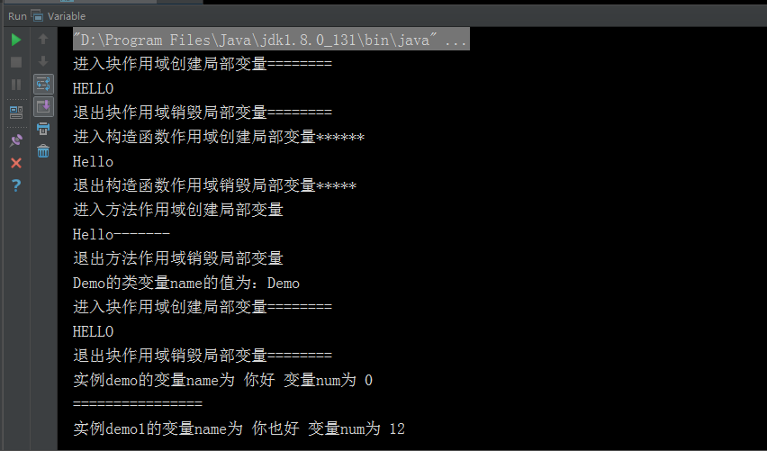

# 变量

Java 变量是指java程序运行中，需要动态改变值得某个量，这个和[常量](/constants)是相对的。
变量这个词不是Java 独有的，类似数学、物理等科学学科中经常使用变量这个词，
数学中 x = y + 7 其中x、y就是变量。

## 三大要素

Java 中定义一个变量需要三大要素：数据类型 变量名 初始值。例如：private String name = "Jordan Zhang";

+ 变量会在内存空间开辟一个存储空间专门存放这个值，数据类型说明的是内存中存储的值属于哪个类型

+ 变量名存放的是内存空间的映射关系，使用变量名时就指的是使用某个内存空间中存放的数据

+ 初始值是指一开始开辟内存空间时存放的数据值，这个数据是可以改变的，所以叫初始值

## 分类

Java 中变量根据作用域不同分为三种类型：

+ 局部变量：局部变量是在方法、构造函数和块中使用的变量，进入作用于的时候创建，退出作用域则销毁

+ 类变量（静态变量）：
    + 类变量是在类中用static修饰的变量，区别局部变量并不在方法和构造函数内
    + 而是在加载类是就进行初始化，存储在静态内存中
    + 可以使用类名+点操作符+变量的形式使用，如User 类中静态变量MALE 的使用：User.MALE;

+ 成员变量（实例变量）：
    + 成员变量是在类中声名，但是它在方法、构造器或者代码块外部
    + 当堆中的对象被分配了一个空间时，每个实例变量的位置就被创建了
    + 类变量可以不进行初始化，类变量会给默认值，数字型为0，布尔型为false,引用型为null
    
## 示例

``` java

public class Variable {

    public static void main(String [] args) {
        Demo demo = new Demo();
        demo.sayHello("World");

        System.out.println("Demo的类变量name的值为：" + Demo.name);

        Demo demo1 = new Demo("你也好", 12);
        System.out.println("实例demo的变量name为 " + demo.getHel() + " 变量num为 " + demo.getNum());
        System.out.println("================");
        System.out.println("实例demo1的变量name为 " + demo1.getHel() + " 变量num为 " + demo1.getNum());
    }
}

class Demo {

    //类变量
    public static String name = "Demo";

    //实例变量
    private String hel = "你好";
    private int num;

    {
        //块局部变量
        System.out.println("进入块作用域创建局部变量========");
        String hello = "HELLO";
        System.out.println(hello);
        System.out.println("退出块作用域销毁局部变量========");
    }

    public Demo() {
        //构造函数局部变量
        System.out.println("进入构造函数作用域创建局部变量******");
        String hello = "Hello";
        System.out.println(hello);
        System.out.println("退出构造函数作用域销毁局部变量*****");
    }

    public static String getName() {
        return name;
    }

    public static void setName(String name) {
        Demo.name = name;
    }

    public String getHel() {
        return hel;
    }

    public void setHel(String hel) {
        this.hel = hel;
    }

    public int getNum() {
        return num;
    }

    public void setNum(int num) {
        this.num = num;
    }

    public Demo(String hel, int num) {
        this.hel = hel;
        this.num = num;
    }

    public String sayHello(String world) {
        //方法局部变量
        System.out.println("进入方法作用域创建局部变量");
        String hello = "Hello-------";
        System.out.println(hello);
        System.out.println("退出方法作用域销毁局部变量");
        return hello + world;
    }
}
``` 

执行结果：

